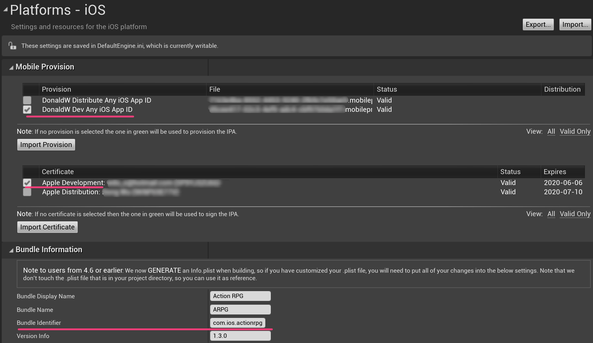
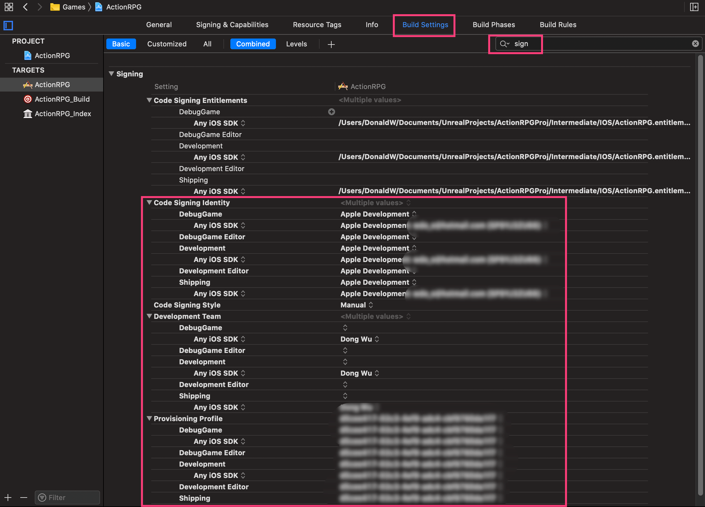

# [WIP] Unreal Source Explained

## About

Unreal Source Explained (USE) is an Unreal source code analysis, **based on profilers**.

USE is just several markdown files, see [main.md/overview](main/main.md).

USE's goals are:
- look inside the Unreal engine source;
- cover all submodules (loop, memory, render, animation, physics, ...)
- overview then detailed;
- quantitative analysis;
- accurate explanation;
- for now, focus on Unreal running on mobile devices (iOS, Android);
- in English;

USE is based on:
- Unreal 4.23~4.25 source code;
- XCode 11 and its Instrument, in order to capture more details, such as graphic memory allocations;
- the [*ActionRPG*](https://www.unrealengine.com/marketplace/en-US/slug/action-rpg) demo, this is a mobile demo that can run on mobile devices, it's public that everyone can access, and it's not-too-simple with enough engine feature applied, such as blueprints, game ability system, etc.;
- running on iOS devices with:
    - CPU cores >= 3 to observe Unreal's multi-thread characteristic,
    - Metal Graphic API enabled

USE is working in progress, I will add contents persitently, usually when 
- I'm curious about some pieces of code,
- or my work demands it.

Therefore, in order to get more code explained, or to improve the explaination quality, **you are always welcomed to fork, add content and make pull-request!**

## Why Profilers?

Why analyze source code by profilers? Why not use debuggers or just read plain source codes by IDEs' source context-aware tool? In fact, I do. I use various tools to help me to read and understand Unreal codes. But they all have different pros and cons:

||Profiler<br>(running game in device with XCode Instruments)| Debugger<br>(running Unreal Editor with Visual Studio) | Source Context-aware Searching |
|--|--|--|--|
| Call stack | 👍👍👍 | 👍👍👍 | ❌
| Big Data<br>(analyize by data mining) | 👍👍👍 | ❌ | ❌
| Variable value | ❌ | 👍👍👍 | ❌
| Branching | ❌ | 👍👍👍 | ❌
| Run on actual device | 👍👍👍 |  ❌ | ❌
| More accurate<br>(Less guess) | 👍👍👍 | 👍👍|❌
| Cover all cases | 👍 | ❌ | 👍👍👍
| Cover all threads | 👍👍👍 | 👍 | ❌
| Easy to setup | ❌ | 👍 | 👍👍👍
| Easy to analyze after setup | 👍👍👍 | 👍 | ❌
| Overall | 👍×19, ❌×3 | 👍×14, ❌×3 | 👍×6, ❌×8

We can see profiler has more thumbs up than the other two in terms of code analysis, hence USE is a profiler-first source analysis. However, remember to use them all and use them wisely.

## Profiling Guide

I've upload some instrument files in the *profile* folder, you can use it as a quick overview. **XCode 11** is required to open these files.   
There are two files in it, both of them are captured in iPadPro 10.5(2017), and contain the Time Profiler and the Allocation.   
The file with "Wait" in the filename is captured with Time Profiler's *Record Waiting Thread* option turned on, this is useful to observe the thread off-cpu waiting time.  
The file with "GPUScene" in the filename is captured with UE 4.23's new mobile feature *mesh drawing pipeline* enabled.    
To reduce the file size, this profile files only capture a very short amount of time, therefore, for a longer and better profile file, you are suggested to build and profile the ActionRPG game on your own.


## Build Guide

Install Unreal Editor in your mac, either install it in Epic Game Launcher, or build it from source.


In order to debug your shaders in the GPU debuggers, you should modify these in **YourEngine/Config/ConsoleVariables.ini**, or add them in **YourGameProj/Config/DefaultEngine.ini**.


```ini
; Uncomment to get detailed logs on shader compiles and the opportunity to retry on errors
;r.ShaderDevelopmentMode=1

; Uncomment when running with a graphical debugger (but not when profiling)
;r.Shaders.Optimize=0
; This one enables shader code symbols
r.Shaders.KeepDebugInfo=1
```


For GPU Scene, it's disabled by default in mobile, you can enable it by setting `r.Mobile.SupportGPUScene=1` in your project's DefaultEngine.ini.

You should have valid [apple developer account](https://developer.apple.com), then create a iOS Development **Provision Profile**, which records these 3 important things: 

- **App ID** pattern, (can have wild card, e.g., com.ios.*), 
- **Certificates**, which is **Development Certification** in this case,
- **Devices** which includs your mac.


From your apple developer account website, please download and import your Development Certification and Provision Profile into your mac. You can manage certifications in **Keychain Access** app, and manage provisions profile in **/Users/{whoami}/Library/MobileDevice/Provisioning Profiles**.

Then in Unreal, choose them in project settings iOS panel (**Edit > Project Settings > Platforms > iOS**), shown in the image below. Make sure provision profile and certification match.




In order to show debug symbols in instruments, you need to enable **Build > Generate dSYM file** in iOS project panel.


Package your game by **File > Package Project**, this may take a long time. Unreal will use XCode to build the game into **YourGameProj/Binaries/IOS/**. Note the dSYM file is also generated.


We still need XCode to sign and deploy the game into the device. Use **File > Refresh XCode Project** to generate XCode project file. Open it in XCode. You should change the **Run** and **Profile** Scheme to **Development**, so XCode will load the debug symbol.


Make sure the generated XCode project also records correct Provision Profiles.




That's it! You can run the game or profiling it!
