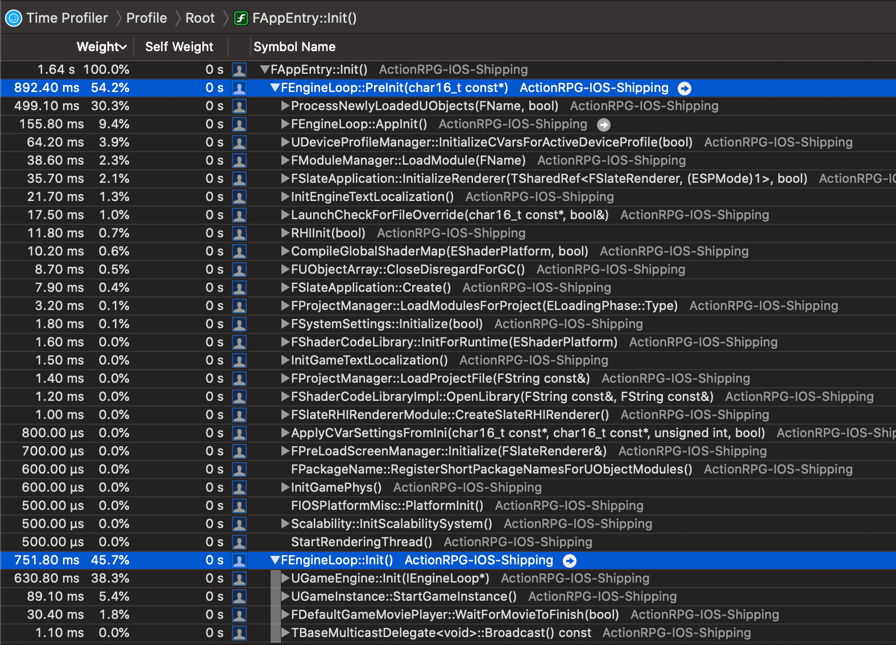
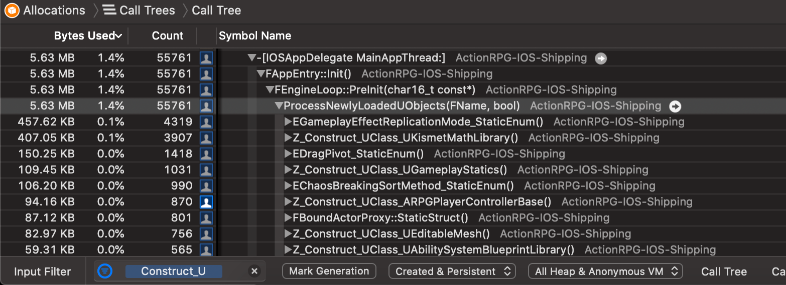

# [WIP] Unreal Source Explained

Unreal Source Explained (USE) is an Unreal source code analysis, based on profilers.  
For more infomation, see the [repo](https://github.com/donaldwuid/unreal_source_explained) in github.

## Contents

1. [Overview](main.md)
1. [Initialization](initialization.md)
1. [Loop](loop.md)
1. [Memory Management](memory.md)
1. [Thread Management](thread.md)
1. [Blueprint Visual Scripting](scripting.md)
1. [Rendering](rendering.md)
1. [Gameplay](gameplay.md)


# Initialization

<!-- TODO: Change this to life-cycle and include both Initialization and Finalization -->

##  Engine Initialization Overview


As you can see in the image above, Unreal is initialized by two main steps: `FEngineLoop::PreInit()`([link](https://github.com/EpicGames/UnrealEngine/blob/42cbf957ad0e713dec57a5828f72d116c8083011/Engine/Source/Runtime/Launch/Private/LaunchEngineLoop.cpp#L993)) and `FEngineLoop::Init()`([link](https://github.com/EpicGames/UnrealEngine/blob/42cbf957ad0e713dec57a5828f72d116c8083011/Engine/Source/Runtime/Launch/Private/LaunchEngineLoop.cpp#L3410)). They are called in `FAppEntry::Init()`([link](https://github.com/EpicGames/UnrealEngine/blob/395c9713d5b5eee9daf8b7077bcac311c85a63a1/Engine/Source/Runtime/Launch/Private/IOS/LaunchIOS.cpp#L372)) in iOS, and `AndroidMain()`([link](https://github.com/EpicGames/UnrealEngine/blob/8951e6117b483a89befe98ac2102caad2ce26cab/Engine/Source/Runtime/Launch/Private/Android/LaunchAndroid.cpp#L445)) in Android.

You may think `PreInit()` is the low-level initializaiton and `Init()` is the high-level.

Note in Unreal there are two ways to manage submodules: [*Module*](https://docs.unrealengine.com/en-US/Programming/BuildTools/UnrealBuildTool/ModuleFiles/index.html) and [*Plugins*](https://docs.unrealengine.com/en-US/Programming/Plugins/index.html). Module conatains only code, while Plugin can contain assets and/or Modules.

To name a few things get initialized in `PreInit()`, in order:
- load core module([link](https://github.com/EpicGames/UnrealEngine/blob/42cbf957ad0e713dec57a5828f72d116c8083011/Engine/Source/Runtime/Launch/Private/LaunchEngineLoop.cpp#L1719)): `LoadCoreModules()`([link](https://github.com/EpicGames/UnrealEngine/blob/42cbf957ad0e713dec57a5828f72d116c8083011/Engine/Source/Runtime/Launch/Private/LaunchEngineLoop.cpp#L3122)) for "CoreUObject";
- fundamental modules([link](https://github.com/EpicGames/UnrealEngine/blob/42cbf957ad0e713dec57a5828f72d116c8083011/Engine/Source/Runtime/Launch/Private/LaunchEngineLoop.cpp#L1838)): `LoadPreInitModules()`([link](https://github.com/EpicGames/UnrealEngine/blob/42cbf957ad0e713dec57a5828f72d116c8083011/Engine/Source/Runtime/Launch/Private/LaunchEngineLoop.cpp#L3136)) for "Engine", "Renderer", "AnimGraphRuntime", "Landscape", "RenderCore";
- "application-like" modules([link](https://github.com/EpicGames/UnrealEngine/blob/42cbf957ad0e713dec57a5828f72d116c8083011/Engine/Source/Runtime/Launch/Private/LaunchEngineLoop.cpp#L1861)): `FEngineLoop::AppInit()`([link](https://github.com/EpicGames/UnrealEngine/blob/42cbf957ad0e713dec57a5828f72d116c8083011/Engine/Source/Runtime/Launch/Private/LaunchEngineLoop.cpp#L4635))
	- localization([link](https://github.com/EpicGames/UnrealEngine/blob/42cbf957ad0e713dec57a5828f72d116c8083011/Engine/Source/Runtime/Launch/Private/LaunchEngineLoop.cpp#L4639)): `BeginInitTextLocalization()`([link](https://github.com/EpicGames/UnrealEngine/blob/068ca68f0b37e2c65bf02254c713fd604d4fc211/Engine/Source/Runtime/Core/Private/Internationalization/TextLocalizationManager.cpp#L293))
	- plugins ([link](https://github.com/EpicGames/UnrealEngine/blob/42cbf957ad0e713dec57a5828f72d116c8083011/Engine/Source/Runtime/Launch/Private/LaunchEngineLoop.cpp#L4778)): `FPluginManager::LoadModulesForEnabledPlugins()` ([link](https://github.com/EpicGames/UnrealEngine/blob/c33049fcbde20fb59e44dfc32b25dc610561314c/Engine/Source/Runtime/Projects/Private/PluginManager.cpp#L985));
	- configs ([link](https://github.com/EpicGames/UnrealEngine/blob/42cbf957ad0e713dec57a5828f72d116c8083011/Engine/Source/Runtime/Launch/Private/LaunchEngineLoop.cpp#L4772)): `FConfigCacheIni::InitializeConfigSystem()`([link](https://github.com/EpicGames/UnrealEngine/blob/73fe4c86de84d8e4d98861f5f3793b1dedbc5190/Engine/Source/Runtime/Core/Private/Misc/ConfigCacheIni.cpp#L3409))
- scalability([link](https://github.com/EpicGames/UnrealEngine/blob/42cbf957ad0e713dec57a5828f72d116c8083011/Engine/Source/Runtime/Launch/Private/LaunchEngineLoop.cpp#L1922)): `InitScalabilitySystem()`([link](https://github.com/EpicGames/UnrealEngine/blob/cbfcbbb93b3d40c36067a9e962b01e2e35149ead/Engine/Source/Runtime/Engine/Private/Scalability.cpp#L337)). *[Scalability](https://docs.unrealengine.com/en-US/Engine/Performance/Scalability/ScalabilityReference/index.html)* adjusts the quality of various features in order to maintain the best performance for your game on different platforms and hardware;
- game physics([link](https://github.com/EpicGames/UnrealEngine/blob/42cbf957ad0e713dec57a5828f72d116c8083011/Engine/Source/Runtime/Launch/Private/LaunchEngineLoop.cpp#L2081)): `InitGamePhys()`([link](https://github.com/EpicGames/UnrealEngine/blob/f9b3324b32be95b1fd37235e7b7f2fbb502db285/Engine/Source/Runtime/Engine/Private/PhysicsEngine/PhysLevel.cpp#L274))
- slate application([link](https://github.com/EpicGames/UnrealEngine/blob/42cbf957ad0e713dec57a5828f72d116c8083011/Engine/Source/Runtime/Launch/Private/LaunchEngineLoop.cpp#L2181)): `FSlateApplication::Create()`([link](https://github.com/EpicGames/UnrealEngine/blob/fd945f737de41823c384f819fd0c0f39444288e4/Engine/Source/Runtime/Slate/Private/Framework/Application/SlateApplication.cpp#L911))
- RHI([link](https://github.com/EpicGames/UnrealEngine/blob/42cbf957ad0e713dec57a5828f72d116c8083011/Engine/Source/Runtime/Launch/Private/LaunchEngineLoop.cpp#L2222)): `RHIInit()`([link](https://github.com/EpicGames/UnrealEngine/blob/b8a9b7a193fa1942002ef3d78520d318dd324ed1/Engine/Source/Runtime/RHI/Private/DynamicRHI.cpp#L192))
- global shaders resources([link](https://github.com/EpicGames/UnrealEngine/blob/42cbf957ad0e713dec57a5828f72d116c8083011/Engine/Source/Runtime/Launch/Private/LaunchEngineLoop.cpp#L2291)): `CompileGlobalShaderMap()`([link](https://github.com/EpicGames/UnrealEngine/blob/c8686161530e05e1013572a4c34ccb52ba197057/Engine/Source/Runtime/Engine/Private/ShaderCompiler/ShaderCompiler.cpp#L4327))
- render thread ([link](https://github.com/EpicGames/UnrealEngine/blob/42cbf957ad0e713dec57a5828f72d116c8083011/Engine/Source/Runtime/Launch/Private/LaunchEngineLoop.cpp#L2339)): `StartRenderingThread()`([link](https://github.com/EpicGames/UnrealEngine/blob/b4a54829162aa07a28846da2e91147912a7b67d8/Engine/Source/Runtime/RenderCore/Private/RenderingThread.cpp#L658));
- most `UObject`s' reflection data([link](https://github.com/EpicGames/UnrealEngine/blob/42cbf957ad0e713dec57a5828f72d116c8083011/Engine/Source/Runtime/Launch/Private/LaunchEngineLoop.cpp#L2557)): `ProcessNewlyLoadedUObjects()`([link](https://github.com/EpicGames/UnrealEngine/blob/b4a54829162aa07a28846da2e91147912a7b67d8/Engine/Source/Runtime/CoreUObject/Private/UObject/UObjectBase.cpp#L983));
- start-up modules: ([link](https://github.com/EpicGames/UnrealEngine/blob/42cbf957ad0e713dec57a5828f72d116c8083011/Engine/Source/Runtime/Launch/Private/LaunchEngineLoop.cpp#L2614)): `LoadStartupCoreModules()`([link](https://github.com/EpicGames/UnrealEngine/blob/42cbf957ad0e713dec57a5828f72d116c8083011/Engine/Source/Runtime/Launch/Private/LaunchEngineLoop.cpp#L3185)): "Core", "Networking", "Messaging", "Slate", "UMG";
- load task graph module([link](https://github.com/EpicGames/UnrealEngine/blob/42cbf957ad0e713dec57a5828f72d116c8083011/Engine/Source/Runtime/Launch/Private/LaunchEngineLoop.cpp#L3078));
- engine and game localizaiton([link](https://github.com/EpicGames/UnrealEngine/blob/42cbf957ad0e713dec57a5828f72d116c8083011/Engine/Source/Runtime/Launch/Private/LaunchEngineLoop.cpp#L3093));

and `Init()` initializes these in order:
- Create the high-level game engine objects([link](https://github.com/EpicGames/UnrealEngine/blob/42cbf957ad0e713dec57a5828f72d116c8083011/Engine/Source/Runtime/Launch/Private/LaunchEngineLoop.cpp#L3481)): `UGameEngine::Init()`([link](https://github.com/EpicGames/UnrealEngine/blob/2f53e5141feb2eaaf521f9193b07bd6103d69230/Engine/Source/Runtime/Engine/Private/GameEngine.cpp#L1012))
	- `UEngine::Init()`([link](https://github.com/EpicGames/UnrealEngine/blob/7256ed00bd50ce4c8d099e9e8495d37b0e5130e5/Engine/Source/Runtime/Engine/Private/UnrealEngine.cpp#L1338)), `UEngine` is abstract base class of `UGameEngine` and `UEdtiorEngine`, and is responsible for management of systems critical to editor or game systems.;
	- `UGameUserSettings::LoadSettings()`([link](https://github.com/EpicGames/UnrealEngine/blob/d803c718c982800f1baf27cd141028b4b48ae95b/Engine/Source/Runtime/Engine/Private/GameUserSettings.cpp#L509));
	- `UGameInstance`([link](https://github.com/EpicGames/UnrealEngine/blob/c33049fcbde20fb59e44dfc32b25dc610561314c/Engine/Source/Runtime/Engine/Classes/Engine/GameInstance.h#L119)), `UGameInstance` is high-level manager object for an instance of the running game
		- create `UWorld` in `UGameInstance::InitializeStandalone()`([link](https://github.com/EpicGames/UnrealEngine/blob/252049ac8a00469d7d2044469fe23d931d6aabea/Engine/Source/Runtime/Engine/Private/GameInstance.cpp#L146)), `UWorld` is the top level object representing a map or a sandbox in which Actors and Components will exist and be rendered;
	- `UGameViewportClient` ([link](https://github.com/EpicGames/UnrealEngine/blob/786a4c405633f103fccfaf501e7813f8a7424c68/Engine/Source/Runtime/Engine/Classes/Engine/GameViewportClient.h#L53))
		- create localplayer for the viewport([link](https://github.com/EpicGames/UnrealEngine/blob/2f53e5141feb2eaaf521f9193b07bd6103d69230/Engine/Source/Runtime/Engine/Private/GameEngine.cpp#L1094)): `UGameViewportClient::SetupInitialLocalPlayer()`([link](https://github.com/EpicGames/UnrealEngine/blob/7256ed00bd50ce4c8d099e9e8495d37b0e5130e5/Engine/Source/Runtime/Engine/Private/GameViewportClient.cpp#L2019))
- and start the high level game engine([link](https://github.com/EpicGames/UnrealEngine/blob/42cbf957ad0e713dec57a5828f72d116c8083011/Engine/Source/Runtime/Launch/Private/LaunchEngineLoop.cpp#L3521)): `UGameEngine::Start()`([link](https://github.com/EpicGames/UnrealEngine/blob/2f53e5141feb2eaaf521f9193b07bd6103d69230/Engine/Source/Runtime/Engine/Private/GameEngine.cpp#L1119))


## UObject Initialization

## Archetype and CDO

To manage `UObject`s, Unreal uses `UObjectBase::ObjectFlags`([link](https://github.com/EpicGames/UnrealEngine/blob/bf95c2cbc703123e08ab54e3ceccdd47e48d224a/Engine/Source/Runtime/CoreUObject/Public/UObject/UObjectBase.h#L239)) to record a `UObject` instance's states.

A `UObject` instance is called *Archetype* object if it has `RF_ArchetypeObject` flag, and it's called *Class Default Object (CDO)* if it has `RF_ClassDefaultObject`.


Unreal eventually calls `StaticConstructObject_Internal()`([link](https://github.com/EpicGames/UnrealEngine/blob/bf95c2cbc703123e08ab54e3ceccdd47e48d224a/Engine/Source/Runtime/CoreUObject/Public/UObject/UObjectGlobals.h#L281)) to create every `UObject` instance, no matter it's via user's `NewObject<T>()` call ([link](https://github.com/EpicGames/UnrealEngine/blob/bf95c2cbc703123e08ab54e3ceccdd47e48d224a/Engine/Source/Runtime/CoreUObject/Public/UObject/UObjectGlobals.h#L1238)) or via Unreal's internal call. Here the most important 3 parameters of `StaticConstructObject_Internal()` are its 
- `UClass* Class`: The class of the object to create. The return value of `Class->GetDefaultObject()` is indeed the CDO;
- `UObject* Template`: If specified, the property values from this object will be copied to the new object, and the new object's ObjectArchetype value will be set to this object. If nullptr, the class default object is used instead.
- `EObjectFlags	InFlags`: The ObjectFlags to assign to the new object.

Parameter `Template` has higher priority than the CDO to copy its property value to the new object([link](https://github.com/EpicGames/UnrealEngine/blob/bf95c2cbc703123e08ab54e3ceccdd47e48d224a/Engine/Source/Runtime/CoreUObject/Private/UObject/UObjectGlobals.cpp#L2717)).

```c++
FObjectInitializer::~FObjectInitializer()
{
	//...
	UObject* Defaults = ObjectArchetype ? ObjectArchetype : BaseClass->GetDefaultObject(false);
	InitProperties(Obj, BaseClass, Defaults, bCopyTransientsFromClassDefaults);
	//...
}
```


The new object's flag is set by the `InFlags` argument. **Usually** it doesn't have `RF_ArchetypeObject` nor `RF_ClassDefaultObject` flag, therefore, the new object is just a normal instance.   
However that's not the case when the new object is a new Archetype object or a new CDO.

So what's archetype and CDO anyway, what's their similarity and difference?


As the above image shows, either an Archetype object, a CDO, or any `UObject` instance can be a **template object** to copy its properties' values into a new object.   

Any `UObject` instance can be a template object, with or without `RF_ArchetypeObject` or `RF_ClassDefaultObject` flag.

Archetype object iteself is initialized from **asset data** (e.g. uasset) in the disk. Its `RF_ArchetypeObject` flag is set when loading the asset in `FLinkerLoad::CreateExport()`([link](https://github.com/EpicGames/UnrealEngine/blob/bc6b9211003ae9e975689bf2b33718f832483a71/Engine/Source/Runtime/CoreUObject/Private/UObject/LinkerLoad.cpp#L4288)):

```c++
UObject* FLinkerLoad::CreateExport( int32 Index )
{
	FObjectExport& Export = ExportMap[ Index ];
	...
	// RF_ArchetypeObject and other flags
	EObjectFlags ObjectLoadFlags = Export.ObjectFlags;
	...
	Export.Object = StaticConstructObject_Internal
	(
		LoadClass,
		ThisParent,
		NewName,
		ObjectLoadFlags,
		EInternalObjectFlags::None,
		Template
	);
}
```

CDO itself is initialized by 
- its **constructor code**, 
- its **Superclass's CDO** if it has `SuperClass`([link](https://github.com/EpicGames/UnrealEngine/blob/749698e58259778b9488e040d2af58e49973d45e/Engine/Source/Runtime/CoreUObject/Private/UObject/Class.cpp#L3020)), 
- and also, by its asset data if it has linked asset in `UClass::SerializeDefaultObject()`([link](https://github.com/EpicGames/UnrealEngine/blob/749698e58259778b9488e040d2af58e49973d45e/Engine/Source/Runtime/CoreUObject/Private/UObject/Class.cpp#L3889)).

CDOs have both the `RF_ClassDefaultObject` **and** `RF_ArchetypeObject` flags, they are set and explained when creating the CDO ([link](https://github.com/EpicGames/UnrealEngine/blob/bf95c2cbc703123e08ab54e3ceccdd47e48d224a/Engine/Source/Runtime/CoreUObject/Private/UObject/Class.cpp#L3073)):
```c++
UObject* UClass::CreateDefaultObject()
{
	...
	// RF_ArchetypeObject flag is often redundant to RF_ClassDefaultObject, but we need to tag
	// the CDO as RF_ArchetypeObject in order to propagate that flag to any default sub objects.
	ClassDefaultObject = StaticAllocateObject(this, GetOuter(), NAME_None, EObjectFlags(RF_Public|RF_ClassDefaultObject|RF_ArchetypeObject));
	...
}
```
For the same reason, all *Default Subobject*s have both `RF_DefaultSubObject` and `RF_ArchetypeObject` flags.

## AActor and UComponent initialization


## Class reflection data
Most (near all) `Z_Construct_UClass_XXX()` fuctions are called only in the initialization stage via `ProcessNewlyLoadedUObjects()`([link](https://github.com/EpicGames/UnrealEngine/blob/b4a54829162aa07a28846da2e91147912a7b67d8/Engine/Source/Runtime/CoreUObject/Private/UObject/UObjectBase.cpp#L983)).


`Z_Construct_UClass_XXX()` are functions that construct the Unreal intrinsic "class reflection data". These functions' code are generated by macro in `IMPLEMENT_INTRINSIC_CLASS`([link](https://github.com/EpicGames/UnrealEngine/blob/0f9ad9685896e0581d0fe963034b1cb82b1a4e3b/Engine/Source/Runtime/CoreUObject/Public/UObject/ObjectMacros.h#L1604)):

```C++
#define IMPLEMENT_INTRINSIC_CLASS(TClass, TRequiredAPI, TSuperClass, TSuperRequiredAPI, TPackage, InitCode) \
	IMPLEMENT_CLASS(TClass, 0) \
	TRequiredAPI UClass* Z_Construct_UClass_##TClass(); \
	struct Z_Construct_UClass_##TClass##_Statics \
	{ \
		static UClass* Construct() \
		{ \
			extern TSuperRequiredAPI UClass* Z_Construct_UClass_##TSuperClass(); \
			UClass* SuperClass = Z_Construct_UClass_##TSuperClass(); \
			UClass* Class = TClass::StaticClass(); \
			UObjectForceRegistration(Class); \
			check(Class->GetSuperClass() == SuperClass); \
			InitCode \
			Class->StaticLink(); \
			return Class; \
		} \
	}; \
	UClass* Z_Construct_UClass_##TClass() \
	{ \
		static UClass* Class = NULL; \
		if (!Class) \
		{ \
			Class = Z_Construct_UClass_##TClass##_Statics::Construct();\
		} \
		check(Class->GetClass()); \
		return Class; \
	} \

    ...
```