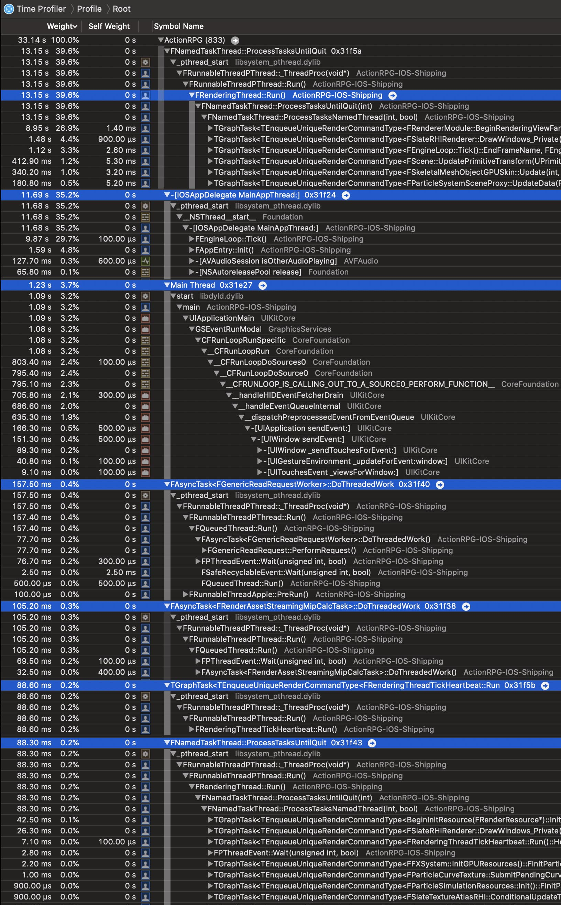
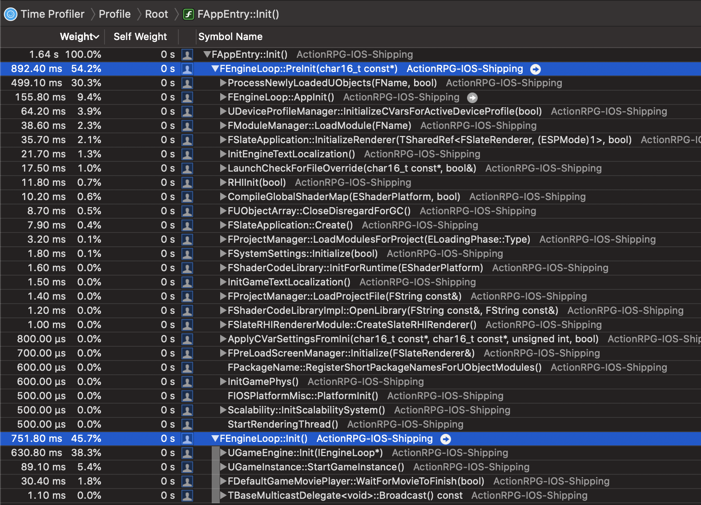
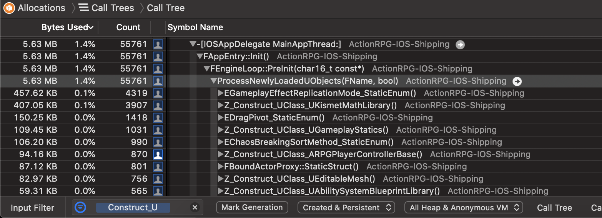
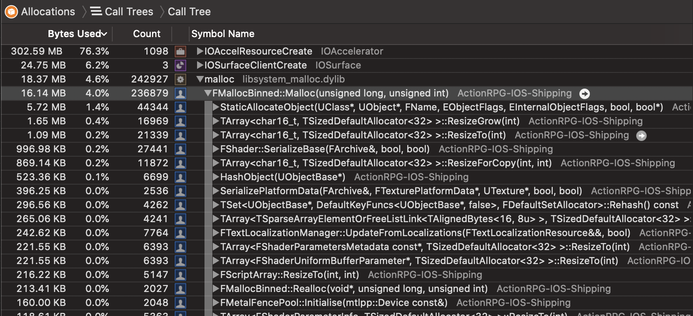
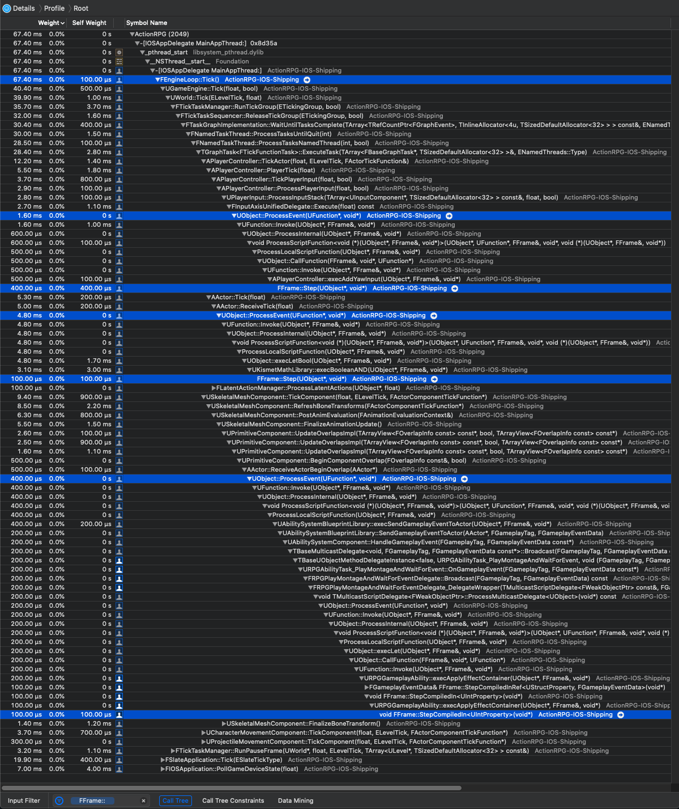

# [WIP] Unreal Source Explained

[toc]

Unreal Source Explained (USE) is an Unreal source code analysis, based on profilers.  
For more infomation, see the [repo](https://github.com/donaldwuid/unreal_source_explained) in github.

## Thread Overview
Unreal has these several important threads:
- Game thread
- Main thread
- Task Threads
	- Render thread (maybe with the additional RHI thread)
	- File I/O threads
	- Mipmap streaming calculations
	- etc.

This following image is the *threads overview* in the profiler. Threads are sorted by their CPU Time, which usually infer their importance.


We'll briefly discuss some important threads below.

### Game Thread
> see "`[IOSAppDelegate MainAppThread:]`" in the above thread overview image.

Game thread's main mission is running `FEngineLoop`([link](https://github.com/EpicGames/UnrealEngine/blob/33e9eedc27e80b9e67c1d1a2667672ed23c7531b/Engine/Source/Runtime/Launch/Public/LaunchEngineLoop.h#L21)), including its initialization `PreInit()`([link](https://github.com/EpicGames/UnrealEngine/blob/42cbf957ad0e713dec57a5828f72d116c8083011/Engine/Source/Runtime/Launch/Private/LaunchEngineLoop.cpp#L1158)) and tick `Tick()`([link](https://github.com/EpicGames/UnrealEngine/blob/42cbf957ad0e713dec57a5828f72d116c8083011/Engine/Source/Runtime/Launch/Private/LaunchEngineLoop.cpp#L4012)).  
Every game is running frame by frame. Inside one frame, several submodules are called sequentially. This routine is known as *Game Loop*.  
`FEngineLoop` is Unreal's game loop. Each time `FEngineLoop::Tick()` is called, that means one new frame has just begun.

Note that in Unreal, game thread's name is `[IOSAppDelegate MainAppThread:]`, it's Unreal's "main thread", do not confuse with the process's main thread.

### Main Thread
> see "`Main Thread`" in the above thread overview image.

This thread is the iOS process's main thread, it's the first thread that gets created and the entry point gets called.  
In Unreal, Main thread doesn't carry out heavy jobs, it just handles some native iOS messages, such as touch event.

### Task Threads
Unreal has several ways to assign tasks to threads, these threads are called *Task Threads*. This task threads management will be discussed in future chapters.  
These following threads are implemented as task threads.
#### Render Threads
> see "`FRenderingThread::Run()`" in the above thread overview image.

Render thread calls `FRenderingThread::Run()`([link](https://github.com/EpicGames/UnrealEngine/blob/b4a54829162aa07a28846da2e91147912a7b67d8/Engine/Source/Runtime/RenderCore/Private/RenderingThread.cpp#L458)), and takes charge of all the rendering tasks, such as updating pritimitives' transform, updating particle systems, drawing slate ui elements, etc. These rendering tasks usually update and prepare rendering data for the GPU to run.

Render thread and the game thread are usually the heaviest 2 threads in most games. You can see the render thread is actually the heaviest thread in this profiling.

Render thread is created in `FEngineLoop::PreInit()`([link](https://github.com/EpicGames/UnrealEngine/blob/42cbf957ad0e713dec57a5828f72d116c8083011/Engine/Source/Runtime/Launch/Private/LaunchEngineLoop.cpp#L2339)). You can observe the thread creation in the Allocation profiler, because each thread creation comes along with some amount of thread stack memory allocation.

Note the thread creation call stack is reversed, the caller is under the callee.

Notice that sometimes you can see there seems to be another thread running `FRenderingThread::Run()` in the Time Profiler, this is because render thread will be recreated during viewport resizes([link](https://github.com/EpicGames/UnrealEngine/blob/b4a54829162aa07a28846da2e91147912a7b67d8/Engine/Source/Runtime/RenderCore/Private/RenderingThread.cpp#L171)), and the Time Profiler captures both the destroyed and recreated render threads. There is only one render thread at any given time.

##### RHI Thread
What's more, Unreal can be [Parallel Rendering](https://docs.unrealengine.com/en-US/Programming/Rendering/ParallelRendering/index.html) with the RHI (Render Hardware Interface) thread, which translates the render thread's render commands into specific device GPU commands. This RHI thread may improve performance in some platform.   
However, in iOS the RHI thread is disabled, because `GRHISupportsRHIThread`([link](https://github.com/EpicGames/UnrealEngine/blob/697a6f07ef518d03ef3611efdafc2e9a89b0fc3c/Engine/Source/Runtime/Apple/MetalRHI/Private/MetalRHI.cpp#L395)) and `bSupportsRHIThread`([link](https://github.com/EpicGames/UnrealEngine/blob/697a6f07ef518d03ef3611efdafc2e9a89b0fc3c/Engine/Source/Runtime/Apple/MetalRHI/Private/MetalRHI.cpp#L226)) is disabled. Unreal has this comment([link](https://github.com/EpicGames/UnrealEngine/blob/bcc5bcf128a758f0de72c4e460a16423a200d915/Engine/Source/Runtime/Apple/MetalRHI/Public/MetalResources.h#L15)):
```c++
/** Parallel execution is available on Mac but not iOS for the moment - it needs to be tested because it isn't cost-free */
```
You might modify the source code to enable the RHI thread in mobile devices with proper device capability test.

#### File I/O Threads
> see "`FAsyncTask<FGenericReadRequestWorker>::DoThreadedWork()`" in the above thread overview image.


## Initialization Overview


As you can see in the image above, Unreal is initialized by two main steps: `FEngineLoop::PreInit()`([link](https://github.com/EpicGames/UnrealEngine/blob/42cbf957ad0e713dec57a5828f72d116c8083011/Engine/Source/Runtime/Launch/Private/LaunchEngineLoop.cpp#L993)) and `FEngineLoop::Init()`([link](https://github.com/EpicGames/UnrealEngine/blob/42cbf957ad0e713dec57a5828f72d116c8083011/Engine/Source/Runtime/Launch/Private/LaunchEngineLoop.cpp#L3410)). They are called in `FAppEntry::Init()`([link](https://github.com/EpicGames/UnrealEngine/blob/395c9713d5b5eee9daf8b7077bcac311c85a63a1/Engine/Source/Runtime/Launch/Private/IOS/LaunchIOS.cpp#L372)) in iOS, and `AndroidMain()`([link](https://github.com/EpicGames/UnrealEngine/blob/8951e6117b483a89befe98ac2102caad2ce26cab/Engine/Source/Runtime/Launch/Private/Android/LaunchAndroid.cpp#L445)) in Android.

You may think `PreInit()` is the low-level initializaiton and `Init()` is the high-level.

Note in Unreal there are two ways to manage submodules: [*Module*](https://docs.unrealengine.com/en-US/Programming/BuildTools/UnrealBuildTool/ModuleFiles/index.html) and [*Plugins*](https://docs.unrealengine.com/en-US/Programming/Plugins/index.html). Module conatains only code, while Plugin can contain assets and/or codes.

To name a few things get initialized in `PreInit()`, in order:
- load core module([link](https://github.com/EpicGames/UnrealEngine/blob/42cbf957ad0e713dec57a5828f72d116c8083011/Engine/Source/Runtime/Launch/Private/LaunchEngineLoop.cpp#L1719)): `LoadCoreModules()`([link](https://github.com/EpicGames/UnrealEngine/blob/42cbf957ad0e713dec57a5828f72d116c8083011/Engine/Source/Runtime/Launch/Private/LaunchEngineLoop.cpp#L3122)) for "CoreUObject";
- fundamental modules([link](https://github.com/EpicGames/UnrealEngine/blob/42cbf957ad0e713dec57a5828f72d116c8083011/Engine/Source/Runtime/Launch/Private/LaunchEngineLoop.cpp#L1838)): `LoadPreInitModules()`([link](https://github.com/EpicGames/UnrealEngine/blob/42cbf957ad0e713dec57a5828f72d116c8083011/Engine/Source/Runtime/Launch/Private/LaunchEngineLoop.cpp#L3136)) for "Engine", "Renderer", "AnimGraphRuntime", "Landscape", "RenderCore";
- "application-like" modules([link](https://github.com/EpicGames/UnrealEngine/blob/42cbf957ad0e713dec57a5828f72d116c8083011/Engine/Source/Runtime/Launch/Private/LaunchEngineLoop.cpp#L1861)): `FEngineLoop::AppInit()`([link](https://github.com/EpicGames/UnrealEngine/blob/42cbf957ad0e713dec57a5828f72d116c8083011/Engine/Source/Runtime/Launch/Private/LaunchEngineLoop.cpp#L4635))
	- localization([link](https://github.com/EpicGames/UnrealEngine/blob/42cbf957ad0e713dec57a5828f72d116c8083011/Engine/Source/Runtime/Launch/Private/LaunchEngineLoop.cpp#L4639)): `BeginInitTextLocalization()`([link](https://github.com/EpicGames/UnrealEngine/blob/068ca68f0b37e2c65bf02254c713fd604d4fc211/Engine/Source/Runtime/Core/Private/Internationalization/TextLocalizationManager.cpp#L293))
	- plugins ([link](https://github.com/EpicGames/UnrealEngine/blob/42cbf957ad0e713dec57a5828f72d116c8083011/Engine/Source/Runtime/Launch/Private/LaunchEngineLoop.cpp#L4778)): `FPluginManager::LoadModulesForEnabledPlugins()` ([link](https://github.com/EpicGames/UnrealEngine/blob/c33049fcbde20fb59e44dfc32b25dc610561314c/Engine/Source/Runtime/Projects/Private/PluginManager.cpp#L985));
	- configs ([link](https://github.com/EpicGames/UnrealEngine/blob/42cbf957ad0e713dec57a5828f72d116c8083011/Engine/Source/Runtime/Launch/Private/LaunchEngineLoop.cpp#L4772)): `FConfigCacheIni::InitializeConfigSystem()`([link](https://github.com/EpicGames/UnrealEngine/blob/73fe4c86de84d8e4d98861f5f3793b1dedbc5190/Engine/Source/Runtime/Core/Private/Misc/ConfigCacheIni.cpp#L3409))
- scalability([link](https://github.com/EpicGames/UnrealEngine/blob/42cbf957ad0e713dec57a5828f72d116c8083011/Engine/Source/Runtime/Launch/Private/LaunchEngineLoop.cpp#L1922)): `InitScalabilitySystem()`([link](https://github.com/EpicGames/UnrealEngine/blob/cbfcbbb93b3d40c36067a9e962b01e2e35149ead/Engine/Source/Runtime/Engine/Private/Scalability.cpp#L337)). *[Scalability](https://docs.unrealengine.com/en-US/Engine/Performance/Scalability/ScalabilityReference/index.html)* adjusts the quality of various features in order to maintain the best performance for your game on different platforms and hardware;
- game physics([link](https://github.com/EpicGames/UnrealEngine/blob/42cbf957ad0e713dec57a5828f72d116c8083011/Engine/Source/Runtime/Launch/Private/LaunchEngineLoop.cpp#L2081)): `InitGamePhys()`([link](https://github.com/EpicGames/UnrealEngine/blob/f9b3324b32be95b1fd37235e7b7f2fbb502db285/Engine/Source/Runtime/Engine/Private/PhysicsEngine/PhysLevel.cpp#L274))
- slate application([link](https://github.com/EpicGames/UnrealEngine/blob/42cbf957ad0e713dec57a5828f72d116c8083011/Engine/Source/Runtime/Launch/Private/LaunchEngineLoop.cpp#L2181)): `FSlateApplication::Create()`([link](https://github.com/EpicGames/UnrealEngine/blob/fd945f737de41823c384f819fd0c0f39444288e4/Engine/Source/Runtime/Slate/Private/Framework/Application/SlateApplication.cpp#L911))
- RHI([link](https://github.com/EpicGames/UnrealEngine/blob/42cbf957ad0e713dec57a5828f72d116c8083011/Engine/Source/Runtime/Launch/Private/LaunchEngineLoop.cpp#L2222)): `RHIInit()`([link](https://github.com/EpicGames/UnrealEngine/blob/b8a9b7a193fa1942002ef3d78520d318dd324ed1/Engine/Source/Runtime/RHI/Private/DynamicRHI.cpp#L192))
- global shaders resources([link](https://github.com/EpicGames/UnrealEngine/blob/42cbf957ad0e713dec57a5828f72d116c8083011/Engine/Source/Runtime/Launch/Private/LaunchEngineLoop.cpp#L2291)): `CompileGlobalShaderMap()`([link](https://github.com/EpicGames/UnrealEngine/blob/c8686161530e05e1013572a4c34ccb52ba197057/Engine/Source/Runtime/Engine/Private/ShaderCompiler/ShaderCompiler.cpp#L4327))
- render thread ([link](https://github.com/EpicGames/UnrealEngine/blob/42cbf957ad0e713dec57a5828f72d116c8083011/Engine/Source/Runtime/Launch/Private/LaunchEngineLoop.cpp#L2339)): `StartRenderingThread()`([link](https://github.com/EpicGames/UnrealEngine/blob/b4a54829162aa07a28846da2e91147912a7b67d8/Engine/Source/Runtime/RenderCore/Private/RenderingThread.cpp#L658));
- most `UObject`s' reflection data([link](https://github.com/EpicGames/UnrealEngine/blob/42cbf957ad0e713dec57a5828f72d116c8083011/Engine/Source/Runtime/Launch/Private/LaunchEngineLoop.cpp#L2557)): `ProcessNewlyLoadedUObjects()`([link](https://github.com/EpicGames/UnrealEngine/blob/b4a54829162aa07a28846da2e91147912a7b67d8/Engine/Source/Runtime/CoreUObject/Private/UObject/UObjectBase.cpp#L983));
- start-up modules: ([link](https://github.com/EpicGames/UnrealEngine/blob/42cbf957ad0e713dec57a5828f72d116c8083011/Engine/Source/Runtime/Launch/Private/LaunchEngineLoop.cpp#L2614)): `LoadStartupCoreModules()`([link](https://github.com/EpicGames/UnrealEngine/blob/42cbf957ad0e713dec57a5828f72d116c8083011/Engine/Source/Runtime/Launch/Private/LaunchEngineLoop.cpp#L3185)): "Core", "Networking", "Messaging", "Slate", "UMG";
- load task graph module([link](https://github.com/EpicGames/UnrealEngine/blob/42cbf957ad0e713dec57a5828f72d116c8083011/Engine/Source/Runtime/Launch/Private/LaunchEngineLoop.cpp#L3078));
- engine and game localizaiton([link](https://github.com/EpicGames/UnrealEngine/blob/42cbf957ad0e713dec57a5828f72d116c8083011/Engine/Source/Runtime/Launch/Private/LaunchEngineLoop.cpp#L3093));

and `Init()` initializes these in order:
- Create the high-level game engine objects([link](https://github.com/EpicGames/UnrealEngine/blob/42cbf957ad0e713dec57a5828f72d116c8083011/Engine/Source/Runtime/Launch/Private/LaunchEngineLoop.cpp#L3481)): `UGameEngine::Init()`([link](https://github.com/EpicGames/UnrealEngine/blob/2f53e5141feb2eaaf521f9193b07bd6103d69230/Engine/Source/Runtime/Engine/Private/GameEngine.cpp#L1012))
	- `UEngine::Init()`([link](https://github.com/EpicGames/UnrealEngine/blob/7256ed00bd50ce4c8d099e9e8495d37b0e5130e5/Engine/Source/Runtime/Engine/Private/UnrealEngine.cpp#L1338)), `UEngine` is abstract base class of `UGameEngine` and `UEdtiorEngine`, and is responsible for management of systems critical to editor or game systems.;
	- `UGameUserSettings::LoadSettings()`([link](https://github.com/EpicGames/UnrealEngine/blob/d803c718c982800f1baf27cd141028b4b48ae95b/Engine/Source/Runtime/Engine/Private/GameUserSettings.cpp#L509));
	- `UGameInstance`([link](https://github.com/EpicGames/UnrealEngine/blob/c33049fcbde20fb59e44dfc32b25dc610561314c/Engine/Source/Runtime/Engine/Classes/Engine/GameInstance.h#L119)), `UGameInstance` is high-level manager object for an instance of the running game
		- create `UWorld` in `UGameInstance::InitializeStandalone()`([link](https://github.com/EpicGames/UnrealEngine/blob/252049ac8a00469d7d2044469fe23d931d6aabea/Engine/Source/Runtime/Engine/Private/GameInstance.cpp#L146)), `UWorld` is the top level object representing a map or a sandbox in which Actors and Components will exist and be rendered;
	- `UGameViewportClient` ([link](https://github.com/EpicGames/UnrealEngine/blob/786a4c405633f103fccfaf501e7813f8a7424c68/Engine/Source/Runtime/Engine/Classes/Engine/GameViewportClient.h#L53))
		- create localplayer for the viewport([link](https://github.com/EpicGames/UnrealEngine/blob/2f53e5141feb2eaaf521f9193b07bd6103d69230/Engine/Source/Runtime/Engine/Private/GameEngine.cpp#L1094)): `UGameViewportClient::SetupInitialLocalPlayer()`([link](https://github.com/EpicGames/UnrealEngine/blob/7256ed00bd50ce4c8d099e9e8495d37b0e5130e5/Engine/Source/Runtime/Engine/Private/GameViewportClient.cpp#L2019))
- and start the high level game engine([link](https://github.com/EpicGames/UnrealEngine/blob/42cbf957ad0e713dec57a5828f72d116c8083011/Engine/Source/Runtime/Launch/Private/LaunchEngineLoop.cpp#L3521)): `UGameEngine::Start()`([link](https://github.com/EpicGames/UnrealEngine/blob/2f53e5141feb2eaaf521f9193b07bd6103d69230/Engine/Source/Runtime/Engine/Private/GameEngine.cpp#L1119))


### Class reflection data
Most (near all) `Z_Construct_UClass_XXX()` fuctions are called only in the initialization stage via `ProcessNewlyLoadedUObjects()`([link](https://github.com/EpicGames/UnrealEngine/blob/b4a54829162aa07a28846da2e91147912a7b67d8/Engine/Source/Runtime/CoreUObject/Private/UObject/UObjectBase.cpp#L983)).


`Z_Construct_UClass_XXX()` are functions that construct the Unreal intrinsic "class reflection data". These functions' code are generated by macro in `IMPLEMENT_INTRINSIC_CLASS`([link](https://github.com/EpicGames/UnrealEngine/blob/0f9ad9685896e0581d0fe963034b1cb82b1a4e3b/Engine/Source/Runtime/CoreUObject/Public/UObject/ObjectMacros.h#L1604)):

```C++
#define IMPLEMENT_INTRINSIC_CLASS(TClass, TRequiredAPI, TSuperClass, TSuperRequiredAPI, TPackage, InitCode) \
	IMPLEMENT_CLASS(TClass, 0) \
	TRequiredAPI UClass* Z_Construct_UClass_##TClass(); \
	struct Z_Construct_UClass_##TClass##_Statics \
	{ \
		static UClass* Construct() \
		{ \
			extern TSuperRequiredAPI UClass* Z_Construct_UClass_##TSuperClass(); \
			UClass* SuperClass = Z_Construct_UClass_##TSuperClass(); \
			UClass* Class = TClass::StaticClass(); \
			UObjectForceRegistration(Class); \
			check(Class->GetSuperClass() == SuperClass); \
			InitCode \
			Class->StaticLink(); \
			return Class; \
		} \
	}; \
	UClass* Z_Construct_UClass_##TClass() \
	{ \
		static UClass* Class = NULL; \
		if (!Class) \
		{ \
			Class = Z_Construct_UClass_##TClass##_Statics::Construct();\
		} \
		check(Class->GetClass()); \
		return Class; \
	} \

    ...
```

## Loop

Inside `FEngineLoop::Tick()`([link](https://github.com/EpicGames/UnrealEngine/blob/42cbf957ad0e713dec57a5828f72d116c8083011/Engine/Source/Runtime/Launch/Private/LaunchEngineLoop.cpp#L4012)), there are many hardcoded submodules' ticks get called sequetially. This following image is the tick overview, however, it's sorted by the CPU Time, not the calling order.


Calling order is important, it's one of the reasons that lead to one-frame-off bugs.

The general rule is: if status<sub>a</sub> is depended by status<sub>b</sub>, then status<sub>a</sub> should gets updated earlier than status<sub>b</sub> inside one frame.  
This seems to be easy, but if there are lots of status, and the dependecies are complicated, it needs lots of effort to achieve correct status update order.   
But luckily, lots status dependecy don't care correct update order at all because their one-frame-off usually dont't result in visually noticeable motion. For other crucial status (e.g., camera, character), they still demands correct update order.

So, here is some important call extractions from `FEngineLoop::Tick()`, sorted by the calling order:
- broadcast the frame begin event([link](https://github.com/EpicGames/UnrealEngine/blob/42cbf957ad0e713dec57a5828f72d116c8083011/Engine/Source/Runtime/Launch/Private/LaunchEngineLoop.cpp#L4083)): `FCoreDelegates::OnBeginFrame`([link](https://github.com/EpicGames/UnrealEngine/blob/5a8595da4c1427e70707158a8173b4ac774faa8e/Engine/Source/Runtime/Core/Private/Misc/CoreDelegates.cpp#L83));
- update the time stamp, max tick rate of this frame([link](https://github.com/EpicGames/UnrealEngine/blob/42cbf957ad0e713dec57a5828f72d116c8083011/Engine/Source/Runtime/Launch/Private/LaunchEngineLoop.cpp#L4101)): `UEngine::UpdateTimeAndHandleMaxTickRate()`([link](https://github.com/EpicGames/UnrealEngine/blob/7256ed00bd50ce4c8d099e9e8495d37b0e5130e5/Engine/Source/Runtime/Engine/Private/UnrealEngine.cpp#L1862))
- get the input data from the OS([link](https://github.com/EpicGames/UnrealEngine/blob/42cbf957ad0e713dec57a5828f72d116c8083011/Engine/Source/Runtime/Launch/Private/LaunchEngineLoop.cpp#L4230)) : `FIOSApplication::PollGameDeviceState()`([link](https://github.com/EpicGames/UnrealEngine/blob/a00dbfadf5baa73b564eecd774305226e4d031b1/Engine/Source/Runtime/ApplicationCore/Private/IOS/IOSApplication.cpp#L73));
- **update the world of objects!**([link](https://github.com/EpicGames/UnrealEngine/blob/42cbf957ad0e713dec57a5828f72d116c8083011/Engine/Source/Runtime/Launch/Private/LaunchEngineLoop.cpp#L4251)): `UGameEngine::Tick()`([link](https://github.com/EpicGames/UnrealEngine/blob/2f53e5141feb2eaaf521f9193b07bd6103d69230/Engine/Source/Runtime/Engine/Private/GameEngine.cpp#L1539)), this is the **most important call** among others;
- process slate operations accumulated in the world ticks([link](https://github.com/EpicGames/UnrealEngine/blob/42cbf957ad0e713dec57a5828f72d116c8083011/Engine/Source/Runtime/Launch/Private/LaunchEngineLoop.cpp#L4354)): `FEngineLoop::ProcessLocalPlayerSlateOperations()`([link](https://github.com/EpicGames/UnrealEngine/blob/42cbf957ad0e713dec57a5828f72d116c8083011/Engine/Source/Runtime/Launch/Private/LaunchEngineLoop.cpp#L3733));
- rearrange and paint the UI([link](https://github.com/EpicGames/UnrealEngine/blob/42cbf957ad0e713dec57a5828f72d116c8083011/Engine/Source/Runtime/Launch/Private/LaunchEngineLoop.cpp#L4357)): `FSlateApplication::Tick()`([link](https://github.com/EpicGames/UnrealEngine/blob/fd945f737de41823c384f819fd0c0f39444288e4/Engine/Source/Runtime/Slate/Private/Framework/Application/SlateApplication.cpp#L1689));
- custom registered tick is called([link](https://github.com/EpicGames/UnrealEngine/blob/42cbf957ad0e713dec57a5828f72d116c8083011/Engine/Source/Runtime/Launch/Private/LaunchEngineLoop.cpp#L4456)): `FTicker::Tick()`([link](https://github.com/EpicGames/UnrealEngine/blob/cbfcbbb93b3d40c36067a9e962b01e2e35149ead/Engine/Source/Runtime/Core/Private/Containers/Ticker.cpp#L56))
- broadcast the frame end event([link](https://github.com/EpicGames/UnrealEngine/blob/42cbf957ad0e713dec57a5828f72d116c8083011/Engine/Source/Runtime/Launch/Private/LaunchEngineLoop.cpp#L4470)): `FCoreDelegates::OnEndFrame`([link](https://github.com/EpicGames/UnrealEngine/blob/5a8595da4c1427e70707158a8173b4ac774faa8e/Engine/Source/Runtime/Core/Private/Misc/CoreDelegates.cpp#L84))

## Memory Management

### Heap allocation
Most heap memory is allocated via `FMallocBinned::Malloc()`([link](https://github.com/EpicGames/UnrealEngine/blob/517200ac3453d54b233c228a24e5060bc0439065/Engine/Source/Runtime/Core/Private/HAL/MallocBinned.cpp#L916)).


`FMallocBinned` is commentted as *"Optimized virtual memory allocator"*, it's actually implemented as [*Memory Pool*](https://en.wikipedia.org/wiki/Memory_pool), where objects with specific size (8B, 16B, ..., 32KB)([link](https://github.com/EpicGames/UnrealEngine/blob/517200ac3453d54b233c228a24e5060bc0439065/Engine/Source/Runtime/Core/Private/HAL/MallocBinned.cpp#L866)) is allocated from corresponding pool([link](https://github.com/EpicGames/UnrealEngine/blob/517200ac3453d54b233c228a24e5060bc0439065/Engine/Source/Runtime/Core/Private/HAL/MallocBinned.cpp#L969)). This can help to reduce memory fragmentation to some degree.  
Allocation is thread-safe and locked for the specific pool.([link](https://github.com/EpicGames/UnrealEngine/blob/517200ac3453d54b233c228a24e5060bc0439065/Engine/Source/Runtime/Core/Private/HAL/MallocBinned.cpp#L974))


### Global override new operator
Some engine (e.g. Unity) uses [*Global overloaded new operator*](https://www.geeksforgeeks.org/overloading-new-delete-operator-c/) to hook the `new` opeartor and make its own custom memory management.  
But in Unreal, only Windows overrides the global `operator new()`([link](https://github.com/EpicGames/UnrealEngine/blob/8951e6117b483a89befe98ac2102caad2ce26cab/Engine/Source/Runtime/Core/Public/MemPro/MemPro.h#L688)), which means, unlike Unity, your code's `new` operator is not managed by the engine, and is just the plain c++ `new`.
```C++
#ifdef OVERRIDE_NEW_DELETE

	#if defined(_WIN32) || defined(_WIN64) || defined(WIN32) || defined(WIN64) || defined(__WIN32__) || defined(__WINDOWS__)
		#include <malloc.h>

		void* operator new(size_t size)
		{
			void* p = malloc(size);
			MEMPRO_TRACK_ALLOC(p, size);
			return p;
		}

		void operator delete(void* p)
		{
			MEMPRO_TRACK_FREE(p);
			free(p);
		}
        ...
	#endif
#endif
```
## Blueprints Visual Scripting
*[Blueprints](https://docs.unrealengine.com/en-US/Engine/Blueprints/Overview/index.html)* is Unreal's visual scripting, it is usually used to write some high-level logic, such as gameplay, UI, etc.


Blueprints is [*event driven*](https://en.wikipedia.org/wiki/Event-driven_programming), and they usually look like this:

The above image is the a ActionRPG's **BP_PlayerController** blueprints event graphs.  
There are two red titled nodes, which are the events node: **InputAction Pause** and **InputAction Inventory**. Event nodes are the start porint of a graph, hence, there are two graphs in the image. The top graph is handling the logic when the pause event triggers, and the bottom graph is handling the inventory.

Like Java and C# having their [*process virtual machine*](https://en.wikipedia.org/wiki/Virtual_machine#Process_virtual_machines) (or just *virtual machine*, VM), Blueprints is also running on a Unreal implemented virtual machine.   
And the following image is the native call stacks of all blueprints of ActionRPG, including the above **BP_PlayerController**:

Important calls are highlighted. You may observe:
- they all start from `UObject::ProcessEvent()`, and end with `FFrame::StepXX()`;
- `FFrame` appears as the parameter all the way along the call stacks;

`FFrame`([link](https://github.com/EpicGames/UnrealEngine/blob/bf95c2cbc703123e08ab54e3ceccdd47e48d224a/Engine/Source/Runtime/CoreUObject/Public/UObject/Stack.h#L83)) is the most important class for the blueprints VM. It should have a better name **FCallStackFrame** to emphasize its relationship with VM and [*call stack frame*](https://en.wikipedia.org/wiki/Call_stack#Structure): each stack frame corresponds to a call to a subroutine wich has not yet termined with a return.   
Anyway, don't confuse that `FFrame` has nothing to do with rendering frame.  

Here is the key fields and methods of `FFrame`, each of its field is additionally commented:

```c++
//
// Information about script execution at one stack level.
//
struct FFrame : public FOutputDevice
{	
public:
	// Variables.
	// the function that is executing
	UFunction* Node;
	// the object that is executing ("this")
	UObject* Object;
	uint8* Code;
	uint8* Locals;

	/** Previous frame on the stack */
	FFrame* PreviousFrame;

	/** contains information on any out parameters */
	FOutParmRec* OutParms;

	/** Currently executed native function */
	UFunction* CurrentNativeFunction;

	...

public:

	// Constructors.
	FFrame( UObject* InObject, UFunction* InNode, void* InLocals, FFrame* InPreviousFrame = NULL, UField* InPropertyChainForCompiledIn = NULL );
	...

	// Functions.
	COREUOBJECT_API void Step( UObject* Context, RESULT_DECL );

	...
};
```

A `FFrame` holds the `UObject* Object` as the object that is executing, `UFunction* Node` and uses the `FFrame* PreviousFrame` to link to the previous stack frame.

There is actually no a concrete stack container of `FFrame` in runtime. The only two places where create the new `FFrame` are `UObject::ProcessEvent()`([link](https://github.com/EpicGames/UnrealEngine/blob/bf95c2cbc703123e08ab54e3ceccdd47e48d224a/Engine/Source/Runtime/CoreUObject/Private/UObject/ScriptCore.cpp#L1855)) and `ProcessScriptFunction()`([link](https://github.com/EpicGames/UnrealEngine/blob/bf95c2cbc703123e08ab54e3ceccdd47e48d224a/Engine/Source/Runtime/CoreUObject/Private/UObject/ScriptCore.cpp#L715)):

```c++
/*-----------------------------
		Virtual Machine
-----------------------------*/

/** Called by VM to execute a UFunction with a filled in UStruct of parameters */
void UObject::ProcessEvent( UFunction* Function, void* Parms )
{
	...

	uint8* Frame = NULL;
	...
	const bool bUsePersistentFrame = (NULL != Frame);
	if (!bUsePersistentFrame)
	{
		Frame = (uint8*)FMemory_Alloca(Function->PropertiesSize);
		// zero the local property memory
		FMemory::Memzero(Frame + Function->ParmsSize, Function->PropertiesSize - Function->ParmsSize);
	}

	// initialize the parameter properties
	FMemory::Memcpy(Frame, Parms, Function->ParmsSize);

	// Create a new local execution stack.
	FFrame NewStack(this, Function, Frame, NULL, Function->Children);

	...

	// Call native function or UObject::ProcessInternal.
	Function->Invoke(this, NewStack, ReturnValueAddress);
	
	...
}
```

```c++

// Helper function to set up a script function, and then execute it using ExecFtor.
// ...
template<typename Exec>
void ProcessScriptFunction(UObject* Context, UFunction* Function, FFrame& Stack, RESULT_DECL, Exec ExecFtor)
{
	...
	FFrame NewStack(Context, Function, nullptr, &Stack, Function->Children);
	
	...

	if( Function->Script.Num() > 0)
	{
		// Execute the code.
		ExecFtor( Context, NewStack, RESULT_PARAM );
	}
	...
}

```

## Gameplay

## Rendering
