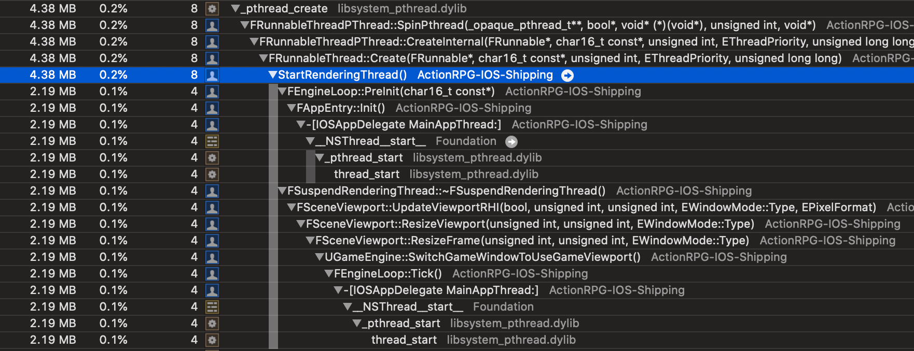

# [WIP] Unreal Source Explained


Unreal Source Explained (USE) is an Unreal source code analysis, based on profilers.  
For more infomation, see the [repo](https://github.com/donaldwuid/unreal_source_explained) in github.

## Contents

1. Overview
1. [Initialization](initialization.md)
1. [Loop](loop.md)
1. [Memory Management](memory.md)
1. [Thread Management](thread.md)
1. [Blueprint Visual Scripting](scripting.md)
1. [Rendering](rendering.md)
1. [Gameplay](gameplay.md)

## Thread Overview

Unreal has these several important threads:
- Game thread
- Main thread
- Task Threads
	- Render thread (maybe with the additional RHI thread)
	- File I/O threads
	- Mipmap streaming calculations
	- etc.

This following image is the *threads overview* in the profiler. Threads are sorted by their CPU Time, which usually infer their importance.


We'll briefly discuss some important threads below.

### Game Thread
> see "`[IOSAppDelegate MainAppThread:]`" in the above thread overview image.

Game thread's main mission is running `FEngineLoop`([link](https://github.com/EpicGames/UnrealEngine/blob/33e9eedc27e80b9e67c1d1a2667672ed23c7531b/Engine/Source/Runtime/Launch/Public/LaunchEngineLoop.h#L21)), including its initialization `PreInit()`([link](https://github.com/EpicGames/UnrealEngine/blob/42cbf957ad0e713dec57a5828f72d116c8083011/Engine/Source/Runtime/Launch/Private/LaunchEngineLoop.cpp#L1158)) and tick `Tick()`([link](https://github.com/EpicGames/UnrealEngine/blob/42cbf957ad0e713dec57a5828f72d116c8083011/Engine/Source/Runtime/Launch/Private/LaunchEngineLoop.cpp#L4012)).  
Every game is running frame by frame. Inside one frame, several submodules are called sequentially. This routine is known as *Game Loop*.  
`FEngineLoop` is Unreal's game loop. Each time `FEngineLoop::Tick()` is called, that means one new frame has just begun.

Note that in Unreal, game thread's name is `[IOSAppDelegate MainAppThread:]`, it's Unreal's "main thread", do not confuse with the process's main thread.

### Main Thread
> see "`Main Thread`" in the above thread overview image.

This thread is the iOS process's main thread, it's the first thread that gets created and the entry point gets called.  
In Unreal, Main thread doesn't carry out heavy jobs, it just handles some native iOS messages, such as touch event.

### Task Threads
Unreal has several ways to assign tasks to threads, these threads are called *Task Threads*. This task threads management will be discussed in future chapters.  
These following threads are implemented as task threads.
#### Render Threads
> see "`FRenderingThread::Run()`" in the above thread overview image.

Render thread calls `FRenderingThread::Run()`([link](https://github.com/EpicGames/UnrealEngine/blob/b4a54829162aa07a28846da2e91147912a7b67d8/Engine/Source/Runtime/RenderCore/Private/RenderingThread.cpp#L458)), and takes charge of all the rendering tasks, such as updating pritimitives' transform, updating particle systems, drawing slate ui elements, etc. These rendering tasks usually update and prepare rendering data for the GPU to run.

Render thread and the game thread are usually the heaviest 2 threads in most games. You can see the render thread is actually the heaviest thread in this profiling.

Render thread is created in `FEngineLoop::PreInit()`([link](https://github.com/EpicGames/UnrealEngine/blob/42cbf957ad0e713dec57a5828f72d116c8083011/Engine/Source/Runtime/Launch/Private/LaunchEngineLoop.cpp#L2339)). You can observe the thread creation in the Allocation profiler, because each thread creation comes along with some amount of thread stack memory allocation.

Note the thread creation call stack is reversed, the caller is under the callee.

Notice that sometimes you can see there seems to be another thread running `FRenderingThread::Run()` in the Time Profiler, this is because render thread will be recreated during viewport resizes([link](https://github.com/EpicGames/UnrealEngine/blob/b4a54829162aa07a28846da2e91147912a7b67d8/Engine/Source/Runtime/RenderCore/Private/RenderingThread.cpp#L171)), and the Time Profiler captures both the destroyed and recreated render threads. There is only one render thread at any given time.

##### RHI Thread
What's more, Unreal can be [Parallel Rendering](https://docs.unrealengine.com/en-US/Programming/Rendering/ParallelRendering/index.html) with the RHI (Render Hardware Interface) thread, which translates the render thread's render commands into specific device GPU commands. This RHI thread may improve performance in some platform.   
However, in iOS the RHI thread is disabled, because `GRHISupportsRHIThread`([link](https://github.com/EpicGames/UnrealEngine/blob/697a6f07ef518d03ef3611efdafc2e9a89b0fc3c/Engine/Source/Runtime/Apple/MetalRHI/Private/MetalRHI.cpp#L395)) and `bSupportsRHIThread`([link](https://github.com/EpicGames/UnrealEngine/blob/697a6f07ef518d03ef3611efdafc2e9a89b0fc3c/Engine/Source/Runtime/Apple/MetalRHI/Private/MetalRHI.cpp#L226)) is disabled. Unreal has this comment([link](https://github.com/EpicGames/UnrealEngine/blob/bcc5bcf128a758f0de72c4e460a16423a200d915/Engine/Source/Runtime/Apple/MetalRHI/Public/MetalResources.h#L15)):
```c++
/** Parallel execution is available on Mac but not iOS for the moment - it needs to be tested because it isn't cost-free */
```
You might modify the source code to enable the RHI thread in mobile devices with proper device capability test.

#### File I/O Threads
> see "`FAsyncTask<FGenericReadRequestWorker>::DoThreadedWork()`" in the above thread overview image.


