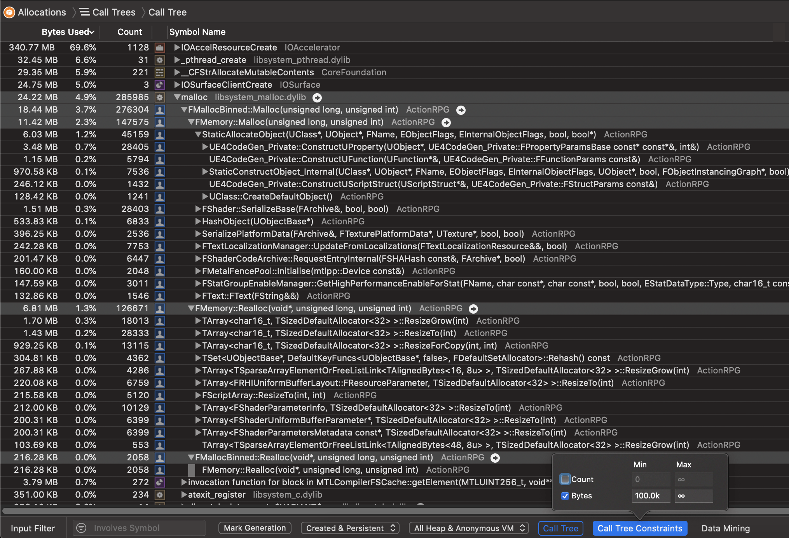
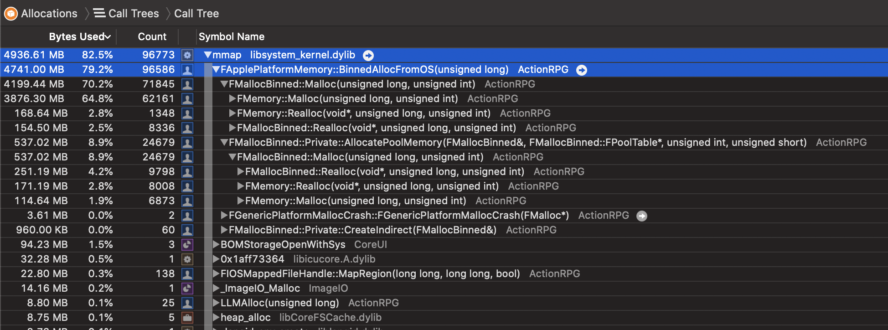

# [WIP] Unreal Source Explained

Unreal Source Explained (USE) is an Unreal source code analysis, based on profilers.  
For more infomation, see the [repo](https://github.com/donaldwuid/unreal_source_explained) in github.

## Contents

1. [Overview](main.md)
1. [Initialization](initialization.md)
1. [Loop](loop.md)
1. [Memory Management](memory.md)
1. [Thread Management](thread.md)
1. [Blueprint Visual Scripting](scripting.md)
1. [Rendering](rendering.md)
1. [Gameplay](gameplay.md)

## Memory Management

### Some Basics

#### Process Virtual Memory Segments
  

As the above overview shows, a process has several important memory segments, from higher virtual address to lower:
- Stack;
- "Data Segment" (not strictly speaking, which includes these following child segments)
	- *Program break*, `brk()` manipulates this to increase or decrease the Heap;
	- Heap;
	- **Uninitialized Data Segment**, or **.bss**, uninitialized static variables, filled with zeros;
		- e.g., `static char * NotInitChar;`
	- **Initialized Data Segement**, or **.data**, or just (the well-known strictly) **Data Segment**, initialized static variables by the programmer;
		- e.g., `static char * InitedChar = "Hello";`
- **Text Segment**, holds the code data and other readonly data;

#### Native Memory APIs

C++ operator `new` and `delete` use C `malloc()` and `free()` to allocate or release memory.

`malloc()` uses `brk()` for small size allocations and `mmap()` for larger size allocations.

`brk()` was POSIX API but now it's not. `mmap()` is POSIX API.  
`brk()` moves the program break (see the picture above), hence increase or decrease the heap size.  
`mmap()` maps a file for access and lazy load the actual content into the virtual memory. When an anonymous file is mapped (by `MAP_ANONYMOUS` flag or `"/dev/zero"` file) , it's similar to memory allocation.

### `FMemory` and `FMallocBinned`
Most heap memory is allocated via `FMallocBinned::Malloc()`([link](https://github.com/EpicGames/UnrealEngine/blob/517200ac3453d54b233c228a24e5060bc0439065/Engine/Source/Runtime/Core/Private/HAL/MallocBinned.cpp#L916)), which is called by `FMemory::Malloc()`([link](https://github.com/EpicGames/UnrealEngine/blob/bf95c2cbc703123e08ab54e3ceccdd47e48d224a/Engine/Source/Runtime/Core/Public/HAL/FMemory.inl#L27)) and the like.


`FMallocBinned` is commentted as *"Optimized virtual memory allocator"*, it's actually implemented as [*Memory Pool*](https://en.wikipedia.org/wiki/Memory_pool), where objects with specific size (8B, 16B, ..., 32KB)([link](https://github.com/EpicGames/UnrealEngine/blob/517200ac3453d54b233c228a24e5060bc0439065/Engine/Source/Runtime/Core/Private/HAL/MallocBinned.cpp#L866)) is allocated from corresponding pool([link](https://github.com/EpicGames/UnrealEngine/blob/517200ac3453d54b233c228a24e5060bc0439065/Engine/Source/Runtime/Core/Private/HAL/MallocBinned.cpp#L969)). This can help to reduce memory fragmentation to some degree.  
Allocation is thread-safe and locked for the specific pool.([link](https://github.com/EpicGames/UnrealEngine/blob/517200ac3453d54b233c228a24e5060bc0439065/Engine/Source/Runtime/Core/Private/HAL/MallocBinned.cpp#L974))


Actually, most of the memory is allocated via `mmap()`, rather than `malloc()`.


Allocating via `mmap()`/`munmap()` gives the engine developer more freedom to customize memory management, because they are lower and simpler system calls than `malloc()`/`free()`. Another reason is, `malloc()` and `free()` in some platform, may only reduce the [*Resident set size (RSS)*](https://en.wikipedia.org/wiki/Resident_set_size), but the *Virtual set size (VSS)* may not decrease even if `free()` is correctly called.


As the following code snippet shows, 
- very small size (224B in iOS): they are allocated via `SmallOSAlloc()`([link](https://github.com/EpicGames/UnrealEngine/blob/bf95c2cbc703123e08ab54e3ceccdd47e48d224a/Engine/Source/Runtime/Core/Private/HAL/MallocBinned.cpp#L944)), which eventually calls `malloc()`;
-  medium size smaller than the binned size: they are allocated via the pool, the pool is allocated via `AllocatePoolMemory()`([link](https://github.com/EpicGames/UnrealEngine/blob/bf95c2cbc703123e08ab54e3ceccdd47e48d224a/Engine/Source/Runtime/Core/Private/HAL/MallocBinned.cpp#L983)), which calls `OSAlloc()` and eventually calls `mmap()`;
- very large size beyond the binned size: they are allocated by `OSAlloc()`, which is also eventually allocated by `mmap()`;

```c++
void* FMallocBinned::Malloc(SIZE_T Size, uint32 Alignment)
{
	...
	bool bUsePools = true;
	if (Size <= Private::SMALL_BLOCK_POOL_SIZE) // 224B in iOS
	{
		...
		// SmallOSAlloc() calls malloc()
		Free = (FFreeMem*)Private::SmallOSAlloc(*this, AlignedSize, ActualPoolSize);
		...
	}
	if (bUsePools)
	{
	if( Size < BinnedSizeLimit)
	{
		// Allocate from pool.
		...
		if( !Pool )
		{
			// AllocatePoolMemory() calls mmap() eventually
			Pool = Private::AllocatePoolMemory(*this, Table, Private::BINNED_ALLOC_POOL_SIZE/*PageSize*/, Size);
		}
		Free = Private::AllocateBlockFromPool(*this, Table, Pool, Alignment);
	}
	else if ( ((Size >= BinnedSizeLimit && Size <= PagePoolTable[0].BlockSize) ||
		(Size > PageSize && Size <= PagePoolTable[1].BlockSize)))
	{
		// Bucket in a pool of 3*PageSize or 6*PageSize
		...
		if( !Pool )
		{
			// AllocatePoolMemory() calls mmap() eventually
			Pool = Private::AllocatePoolMemory(*this, Table, PageCount*PageSize, BinnedSizeLimit+BinType);
		}

		Free = Private::AllocateBlockFromPool(*this, Table, Pool, Alignment);
	}
	else
	{
		// Use OS for large allocations.
		...
		// OSAlloc() calls mmap()
		Free = (FFreeMem*)Private::OSAlloc(*this, AlignedSize, ActualPoolSize);
		...
	}
	}

	MEM_TIME(MemTime += FPlatformTime::Seconds());
	return Free;
}
```

### Global override new operator
Engines (e.g. Unity) usually use [*Global overloaded new operator*](https://www.geeksforgeeks.org/overloading-new-delete-operator-c/) to hook the `new` opeartor and make its own custom memory management.  
Unreal also overloads the global `operator new()`([link](https://github.com/EpicGames/UnrealEngine/blob/b4a54829162aa07a28846da2e91147912a7b67d8/Engine/Source/Runtime/Core/Public/Modules/Boilerplate/ModuleBoilerplate.h#L29)), which uses `FMemory::Malloc()` to allocate and manage memory.
```c++
#define REPLACEMENT_OPERATOR_NEW_AND_DELETE \
	void* operator new  ( size_t Size ) { return FMemory::Malloc( Size ); } \
	void* operator new[]( size_t Size ) { return FMemory::Malloc( Size ); } \
	...\
	void operator delete  ( void* Ptr ) { FMemory::Free( Ptr ); } \
	void operator delete[]( void* Ptr ) { FMemory::Free( Ptr ); } \
	...\
```