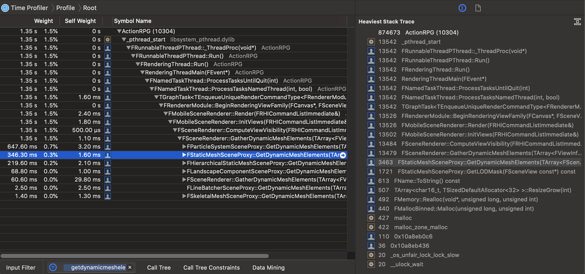
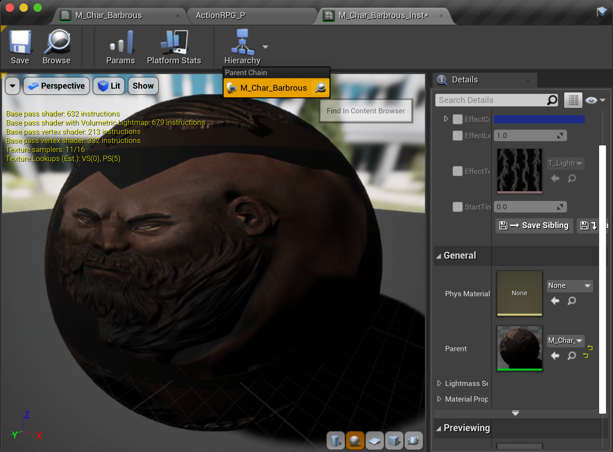
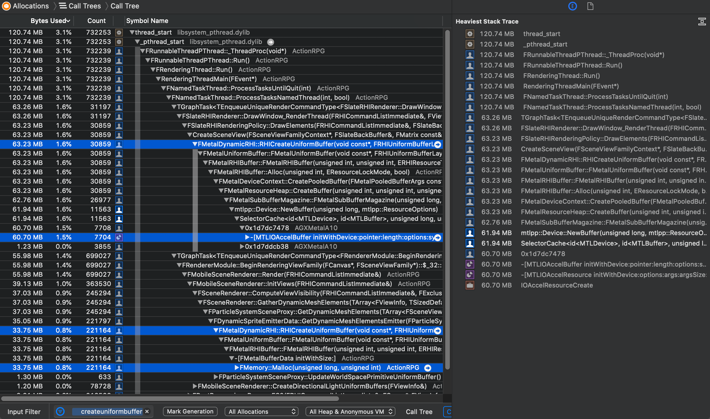
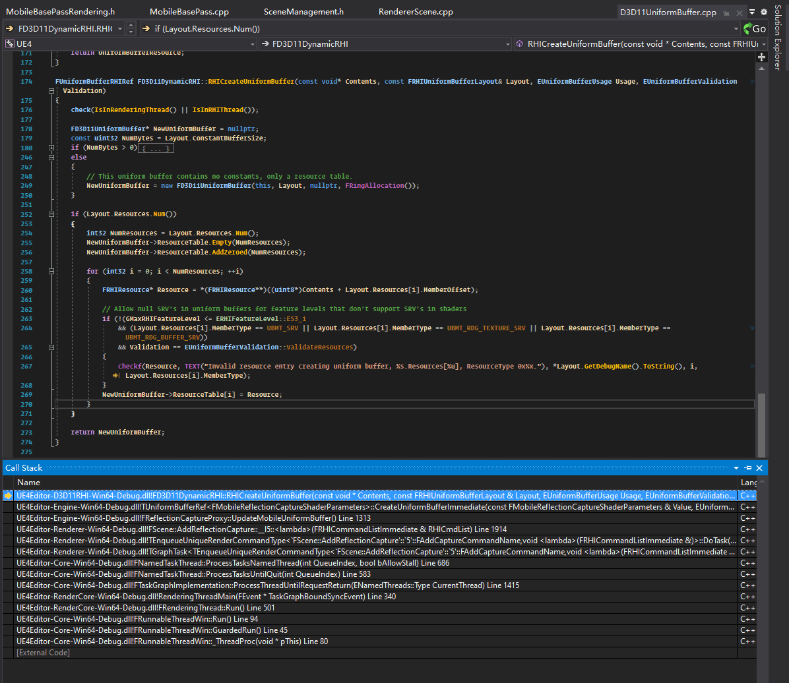
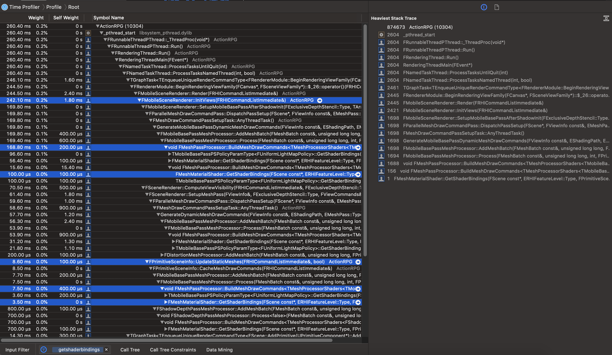
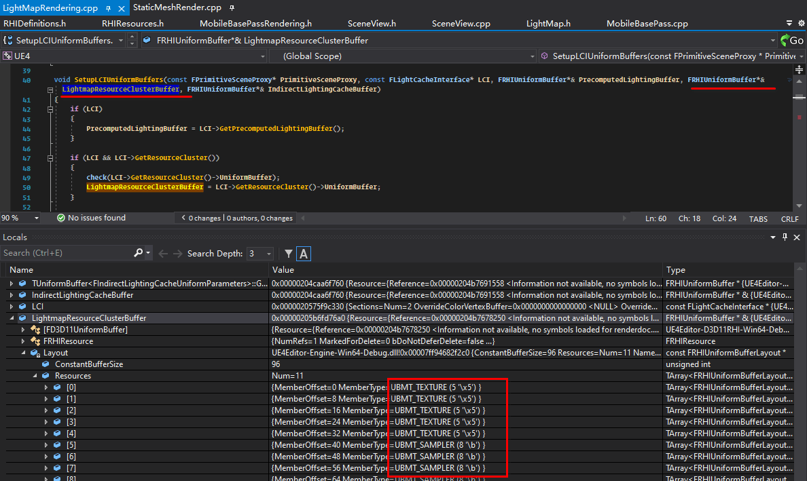

# [WIP] Unreal Source Explained

Unreal Source Explained (USE) is an Unreal source code analysis, based on profilers.  
For more infomation, see the [repo](https://github.com/donaldwuid/unreal_source_explained) in github.

## Contents

1. [Overview](main.md)
1. [Initialization](initialization.md)
1. [Loop](loop.md)
1. [Memory Management](memory.md)
1. [Thread Management](thread.md)
1. [Blueprint Visual Scripting](scripting.md)
1. [Rendering](rendering.md)
1. [Gameplay](gameplay.md)


# Rendering

## Prepare

In order to debug your shaders in the GPU debuggers, you should modify Engine/Config/ConsoleVariables.ini:

```ini
; Uncomment to get detailed logs on shader compiles and the opportunity to retry on errors
r.ShaderDevelopmentMode=1

; Uncomment when running with a graphical debugger (but not when profiling)
r.Shaders.Optimize=0
r.Shaders.KeepDebugInfo=1
```

For GPU Scene, it's disabled by default in mobile, you can enable it by setting `r.Mobile.SupportGPUScene=1` in your project's DefaultEngine.ini.

## Basics

Unreal duplicates most rendering-related things into 2 threads, the game thread and the rendering thread.

You can memorize it by these patterns:

- `U**` are all in game thread,
	- all of their codes are in engine module,
- `F**` are all in rendering thread,
	- `F**Proxy` and `FMaterial`'s codes are all in game module,
	- others' codes are in render module.

| Game Thread | Rendering Thread||
|--|--|--|
| **Engine Module** | **Engine Module** | **Rendering Module** |
||
|**World (Scene):**|
|`UWorld`||`FScene`|
|`ULevel`||
|`USceneComponent`||
||
|**Primitive:**
|`UPrimitiveComponent`|`FPrimitiveSceneProxy`||
|||`FPrimitiveSceneInfo`|
||`F**SceneProxy`,<br>inehrited from `FPrimitiveSceneProxy`,<br> has `FVertexyFactory` and `UMaterialInterface`
||
|**View:**
|||`FSceneView`
|`ULocalPlayer`||`FSceneViewState`|
|||`FSceneRenderer`,<br>derived class: `FMobileSceneRenderer`|
||
|**Light:** 
|`ULightComponent`|`FLightSceneProxy`|
|||`FLightSceneInfo`|
||
|**Material and Shader:** 
|`UMaterialInterface`,<br>derived class: `UMaterial` and `UMaterialInstance` |`FMaterial`,<br>derived class: `FMaterialResource` and `FMaterialRenderProxy`|
|||`FShaderType`,<br>derived class: `FMaterialShaderType`|
|||`FShader`,<br>derived class: `FMaterialShader`|


## New Mesh Drawing Pipeline

For better support of massive primitives, GPU driven pipeline and ray-tracing, Epic has refactored and introduce a new [Mesh Drawing Pipeline](https://docs.unrealengine.com/en-US/Programming/Rendering/MeshDrawingPipeline/index.html)(MDP) in 4.22. And Unreal give a [talk](https://www.youtube.com/watch?v=UJ6f1pm_sdU) about it.

The new pipeline is summarized by unreal as:


Compared to the old *immediate mode* pipeline, the new MDP is kinda *retain mode*. It adds new `FMeshDrawCommand` to cache the draw commands, then merge and sort them. `FMeshPassProcessor` replaces the old *Drawing Policy* to generate commands.

The new MDP is all about caching, and here is its 3 different caching code paths,


Which means, during one frame,

- dyanmic primitive caches nothing,
- semi-static primitive whose vertex factory depends on the view, can only cahce its `FMeshBatch`,
- completely static prmitive can cache both `FMeshBatch` and `FMeshDrawCommand`.

### Primitive Scene Proxy

`FPrimitiveSceneProxy`([link](https://github.com/EpicGames/UnrealEngine/blob/9cb729729cf2130ed4ccb2a71eae8818916f4892/Engine/Source/Runtime/Engine/Public/PrimitiveSceneProxy.h#L126)) is just the rendering thread counterpart of `UPrimitiveComponent`. Both of them is intended to be subclassed to support different primitive types, for example,

|`UPrimitiveComponent`|`FPrimitiveSceneProxy`|
|--|--|
|`UStaticMeshComponent`|`FStaticMeshSceneProxy`
|`USkeletalMeshComponent`|`FSkeletalMeshSceneProxy`|
|`UHierarchicalInstancedStaticMeshComponent`|`FHierarchicalStaticMeshSceneProxy`|
|`ULandscapeComponent`|`FLandscapeComponentSceneProxy`|
|...|...|

### Mesh Batch


`FMeshBatch` cantains all infomations about **all passes** of one primitive, including the vertex buffer (in vertex factory) and material, etc.

```c++
/**
 * A batch of mesh elements, all with the same material and vertex buffer
 */
struct FMeshBatch
{
	TArray<FMeshBatchElement,TInlineAllocator<1> > Elements;
	...
	uint32 ReverseCulling : 1;
	uint32 bDisableBackfaceCulling : 1;
	/** 
	 * Pass feature relevance flags.
	 */
	uint32 CastShadow		: 1;	// Whether it can be used in shadow renderpasses.
	uint32 bUseForMaterial	: 1;	// Whether it can be used in renderpasses requiring material outputs.
	uint32 bUseForDepthPass : 1;	// Whether it can be used in depth pass.
	uint32 bUseAsOccluder	: 1;	// Hint whether this mesh is a good occluder.
	...

	/** Vertex factory for rendering, required. */
	const FVertexFactory* VertexFactory;

	/** Material proxy for rendering, required. */
	const FMaterialRenderProxy* MaterialRenderProxy;
	...
};
```

For static mesh batches, they are stored in their primitive, see the ownership chain below,

- `FPrimitiveSceneInfo* FPrimitiveSceneProxy::PrimitiveSceneInfo`
- `TArray<FStaticMeshBatch> FPrimitiveSceneInfo::StaticMeshes`

and they are collected once they are added to the scene, and cached,


For dynamic mesh batches, `FMeshElementCollector FSceneRenderer::MeshCollector`([link](https://github.com/EpicGames/UnrealEngine/blob/c1edbcc5f2d8d198b9bbbde906426a3733d8f134/Engine/Source/Runtime/Renderer/Private/SceneRendering.h#L1412)) stores an array of `FMeshBatch`.  
During each frame in `InitView()`, `FSceneRenderer` calls `FPrimitiveSceneProxy::GetDynamicMeshElements()` to generate the dynamic `FMeshBatch` ,



### Mesh Draw Command

`FMeshDrawCommand`([link](https://github.com/EpicGames/UnrealEngine/blob/017efe88c610f06521a7f48b21e930c73e4f79ea/Engine/Source/Runtime/Renderer/Public/MeshPassProcessor.h#L442)) describes a mesh **pass** draw call, captured just above the RHI. It just contains the only data needed to draw.

```c++
class FMeshDrawCommand
{
public:
	/** Resource bindings */
	FMeshDrawShaderBindings ShaderBindings;
	FVertexInputStreamArray VertexStreams;
	FRHIIndexBuffer* IndexBuffer;

	/** PSO */
	FGraphicsMinimalPipelineStateId CachedPipelineId;

	/** Draw command parameters */
	uint32 FirstIndex;
	uint32 NumPrimitives;
	uint32 NumInstances;
	...
}
```

For static draw commands, they are stored in `FScene`, see the ownership chain below,

- `FScene* FSceneRenderer::Scene`
- `FCachedPassMeshDrawList FScene::CachedDrawLists[EMeshPass::Num];`
- `TSparseArray<FMeshDrawCommand> FCachedPassMeshDrawList::MeshDrawCommands`

For dynamic draw commands they are stored in the `FViewInfo`, see the ownership chain below,

- View, `TArray<FViewInfo> FSceneRenderer::Views`
- `TStaticArray<FParallelMeshDrawCommandPass, EMeshPass::Num> FViewInfo::ParallelMeshDrawCommandPasses`
- `FMeshDrawCommandPassSetupTaskContext FParallelMeshDrawCommandPass::TaskContext`,
- Dynamic draw command: `FDynamicMeshDrawCommandStorage FMeshDrawCommandPassSetupTaskContext::MeshDrawCommandStorage`
- `TChunkedArray<FMeshDrawCommand> FDynamicMeshDrawCommandStorage::MeshDrawCommands`

And the static and dynamic draw commands are built by these following calls,


Dynamic draw commands, since they are view-dependant and stored in `FViewInfo`, they are initiated from `FMobileSceneRenderer::InitViews()` or `FSceneRenderer::ComputeViewVisibility()`, and both of them go to `GenerateDynamicMeshDrawCommands()`.  
Static draw commands, since they ared stored in the `FScene`, they are initiated from `FScene::AddPrimitive()`, which of cause, right after the primitive is added to the scene.  
After that, both the dynamic and static draw commands share the same remaining code path from `FMobileBasePassMeshProcessor::AddMeshBatch()` to `FMeshPassProcessor::BuildMeshDrawCommands<..>()`.

## Material Shader Pipeline

### Overview

Like Blueprint, *Material Editor* is also a node-based visual scripiting envrironment, for creating *Material Shader*.


Each node is an *Expression*, you can use various kinds of expressions (e.g., Texture Sample, Add, etc.) to write your own shader logic. Exprssions eventually flow into the *Result Node* (e.g., M_Char_Barbrous above) via *Pin*s (e.g., Base Color, Metallic). Material shader can promote variables into *Parameter*s.

*Material Instance* is subclass of Material Shader. It's data oriented and only specify the input argument of parent material shader. Changes made to material shader will cause shader recompilation, while changes of material instance won't.


### Resources Creation

TODO

### Resources and Uniform Buffer

How does Unreal manage shader resources? How does it pass resources from the material shader into the GPU?

In `FUniformExpressionSet::FillUniformBuffer()`([link](https://github.com/EpicGames/UnrealEngine/blob/940eb3a4a629936395b5b5ef078792d8679f0cbf/Engine/Source/Runtime/Engine/Private/Materials/MaterialUniformExpressions.cpp#L435)), expressions' value is extracted and fill into `TempBuffer`.

```c++
void FUniformExpressionSet::FillUniformBuffer(const FMaterialRenderContext& MaterialRenderContext, uint8* TempBuffer, ...) const {
	...
	void* BufferCursor = TempBuffer;
	...
	// Dump vector expression into the buffer.
	for(int32 VectorIndex = 0;VectorIndex < UniformVectorExpressions.Num();++VectorIndex) {
		FLinearColor VectorValue(0, 0, 0, 0);
		UniformVectorExpressions[VectorIndex]->GetNumberValue(MaterialRenderContext, VectorValue);

		FLinearColor* DestAddress = (FLinearColor*)BufferCursor;
		*DestAddress = VectorValue;
		BufferCursor = DestAddress + 1;
	}
	// Cache 2D texture uniform expressions.
	for(int32 ExpressionIndex = 0;ExpressionIndex < Uniform2DTextureExpressions.Num();ExpressionIndex++) {
		const UTexture* Value;
		Uniform2DTextureExpressions[ExpressionIndex]->GetTextureValue(MaterialRenderContext,MaterialRenderContext.Material,Value);
		void** ResourceTableTexturePtr = (void**)((uint8*)BufferCursor + 0 * SHADER_PARAMETER_POINTER_ALIGNMENT);
		void** ResourceTableSamplerPtr = (void**)((uint8*)BufferCursor + 1 * SHADER_PARAMETER_POINTER_ALIGNMENT);
		BufferCursor = ((uint8*)BufferCursor) + (SHADER_PARAMETER_POINTER_ALIGNMENT * 2);
		...
		*ResourceTableTexturePtr = Value->TextureReference.TextureReferenceRHI;
		FSamplerStateRHIRef* SamplerSource = &Value->Resource->SamplerStateRHI;
		*ResourceTableSamplerPtr = *SamplerSource;
	}
	...
}
```

Where dose `TempBuffer` come from? From the call stack below, we can find out.


Expressions' value is recoreded in `FMaterialRenderProxy::UniformExpressionCache[]`([link](https://github.com/EpicGames/UnrealEngine/blob/534dd2cadda59f8d31f3dd8b80d5cd89f084a4f8/Engine/Source/Runtime/Engine/Public/MaterialShared.h#L1920)). That makes sense, because `FMaterialRenderProxy` is the render proxy of a material.

```c++
/**
 * A material render proxy used by the renderer.
 */
class ENGINE_VTABLE FMaterialRenderProxy : public FRenderResource {
public:
	/** Cached uniform expressions. */
	mutable FUniformExpressionCache UniformExpressionCache[ERHIFeatureLevel::Num];
	/** Cached external texture immutable samplers */
	mutable FImmutableSamplerState ImmutableSamplerState;


	/**
	 * Evaluates uniform expressions and stores them in OutUniformExpressionCache.
	 * @param OutUniformExpressionCache - The uniform expression cache to build.
	 * @param MaterialRenderContext - The context for which to cache expressions.
	 */
	void ENGINE_API EvaluateUniformExpressions(FUniformExpressionCache& OutUniformExpressionCache, const FMaterialRenderContext& Context, class FRHICommandList* CommandListIfLocalMode = nullptr) const;

	virtual bool GetVectorValue(const FMaterialParameterInfo& ParameterInfo, FLinearColor* OutValue, const FMaterialRenderContext& Context) const = 0;
	virtual bool GetScalarValue(const FMaterialParameterInfo& ParameterInfo, float* OutValue, const FMaterialRenderContext& Context) const = 0;
	virtual bool GetTextureValue(const FMaterialParameterInfo& ParameterInfo,const UTexture** OutValue, const FMaterialRenderContext& Context) const = 0;

	// FRenderResource interface.
	ENGINE_API virtual void InitDynamicRHI() override;
	ENGINE_API virtual void ReleaseDynamicRHI() override;
	ENGINE_API virtual void ReleaseResource() override;
	...
private:
	/** 
	 * Tracks all material render proxies in all scenes, can only be accessed on the rendering thread.
	 * This is used to propagate new shader maps to materials being used for rendering.
	 */
	ENGINE_API static TSet<FMaterialRenderProxy*> MaterialRenderProxyMap;
	...
};
```

`FUniformExpressionCache` wraps a `FUniformBufferRHIRef`, which essentially is a reference to `FUniformBufferRHI`([link](https://github.com/EpicGames/UnrealEngine/blob/f1d65a58e687e4b9e0f71d7c661d9460c517e8f7/Engine/Source/Runtime/RHI/Public/RHIResources.h#L363)). So, the key question is, what is a uniform buffer?

Unreal uses *Uniform Buffer* to represent *Constant Buffer* and *Resource Handle Table* in RHI. Different graphic API implements `FUniformBufferRHI` to create the actual constant buffer and resource table.

In iOS, `FMetalUniformBuffer::FMetalUniformBuffer()`([link](https://github.com/EpicGames/UnrealEngine/blob/f1d65a58e687e4b9e0f71d7c661d9460c517e8f7/Engine/Source/Runtime/Apple/MetalRHI/Private/MetalUniformBuffer.cpp#L177)) allocates about 120MB memory, which is huge.


In Direct3D, it's created via `FD3D11DynamicRHI::RHICreateUniformBuffer()`([link](https://github.com/EpicGames/UnrealEngine/blob/e99c0b858e283af77f7ca78e249fd6376da0e33d/Engine/Source/Runtime/Windows/D3D11RHI/Private/D3D11UniformBuffer.cpp#L174)),


TODO: How resource handle is related to the actual GPU resources.


<!--
```c++
class FRHIUniformBuffer : public FRHIResource
{

private:
	/** Layout of the uniform buffer. */
	const FRHIUniformBufferLayout* Layout;

	uint32 LayoutConstantBufferSize;
};
```
-->


### Shader Bindings

Shaders can declare its input parameters, but who does the job to pass the actual resource argument to the shader?

*Shader binding* binds a shader's resources to the shader.

Shader bindings are stored in `FMeshDrawCommand`, see the ownership chain below,

- `FMeshDrawShaderBindings FMeshDrawCommand::ShaderBindings`
- `TArray<FMeshDrawShaderBindingsLayout> FMeshDrawShaderBindings::ShaderLayouts`
- `class FMeshDrawSingleShaderBindings : public FMeshDrawShaderBindingsLayout`
- `const FShaderParameterMapInfo& FMeshDrawShaderBindingsLayout::ParameterMapInfo`

During building the mesh draw commands, `FMeshPassProcessor::BuildMeshDrawCommands<..>()` pulls the shader binding data from the shader, as follows,


`FShaderParameterMapInfo`([link](https://github.com/EpicGames/UnrealEngine/blob/f1d65a58e687e4b9e0f71d7c661d9460c517e8f7/Engine/Source/Runtime/RenderCore/Public/Shader.h#L246)) describes the layout of shader's parameters. It contains parameters' base index and size of various resources (e.g., Uniform Buffers, Texture Samplers, SRVs and loose parameter buffers). It's serialized into `FShaderResource::ParameterMapInfo` during the game start up or the new level streamed in.

```c++
class FShaderParameterInfo
{
public:
	uint16 BaseIndex;
	uint16 Size;
	...
};
class FShaderParameterMapInfo
{
public:
	TArray<FShaderParameterInfo> UniformBuffers;
	TArray<FShaderParameterInfo> TextureSamplers;
	TArray<FShaderParameterInfo> SRVs;
	TArray<FShaderLooseParameterBufferInfo> LooseParameterBuffers;
	...
};
```

`FMeshDrawShaderBindingsLayout`([link](FMeshDrawShaderBindingsLayout)) references one `FShaderParameterMapInfo` and provides some additional layout accessors.   

```c++
/** Stores the number of each resource type that will need to be bound to a single shader, computed during shader reflection. */
class FMeshDrawShaderBindingsLayout
{
public:
	const FShaderParameterMapInfo& ParameterMapInfo;
	...
protected:
	inline uint32 GetUniformBufferOffset() const { return 0; }
	inline uint32 GetSamplerOffset() const
	{
		return ParameterMapInfo.UniformBuffers.Num() * sizeof(FRHIUniformBuffer*);
	}
	...
	friend class FMeshDrawShaderBindings;
};
```

`FMeshDrawSingleShaderBindings`([link](https://github.com/EpicGames/UnrealEngine/blob/f1d65a58e687e4b9e0f71d7c661d9460c517e8f7/Engine/Source/Runtime/Renderer/Public/MeshDrawShaderBindings.h#L93)) inherits from `FMeshDrawShaderBindingsLayout`, and does the actual resource binding according to the layout. Its `Data` is a binary stream recording shader resources' references.

```c++
class FMeshDrawSingleShaderBindings : public FMeshDrawShaderBindingsLayout
{
private:
	uint8* Data;

public:
	template<typename UniformBufferStructType>
	void Add(const TShaderUniformBufferParameter<UniformBufferStructType>& Parameter, const TUniformBufferRef<UniformBufferStructType>& Value)
	{
		...
		// writes value to `Data` with correct offset
		WriteBindingUniformBuffer(Value.GetReference(), Parameter.GetBaseIndex());
	}
	...
	void AddTexture(
		FShaderResourceParameter TextureParameter,
		FShaderResourceParameter SamplerParameter,
		FRHISamplerState* SamplerStateRHI,
		FRHITexture* TextureRHI)
	{
		...
		// writes value to `Data` with correct offset
		WriteBindingTexture(TextureRHI, TextureParameter.GetBaseIndex());
		...
		WriteBindingSampler(SamplerStateRHI, SamplerParameter.GetBaseIndex());
	}
	...
};
```

But since `BuildMeshDrawCommands<>()`([link](https://github.com/EpicGames/UnrealEngine/blob/697a6f07ef518d03ef3611efdafc2e9a89b0fc3c/Engine/Source/Runtime/Renderer/Public/MeshPassProcessor.inl#L10)) is the only place that do the shader bindings, how can it handles various different bindings? In fact, it's a template method, the template argument make it possible to handle it, see the snippet below,

```c++
template<typename PassShadersType, typename ShaderElementDataType>
void FMeshPassProcessor::BuildMeshDrawCommands(..., PassShadersType PassShaders, const ShaderElementDataType& ShaderElementData)
{
	...
	if (PassShaders.VertexShader)
	{
		FMeshDrawSingleShaderBindings ShaderBindings = SharedMeshDrawCommand.ShaderBindings.GetSingleShaderBindings(SF_Vertex);
		PassShaders.VertexShader->GetShaderBindings(..., ShaderElementData, ShaderBindings);
	}
	if (PassShaders.PixelShader) { ... }
	...

	const int32 NumElements = MeshBatch.Elements.Num();

	for (int32 BatchElementIndex = 0; BatchElementIndex < NumElements; BatchElementIndex++)
	{
		if ((1ull << BatchElementIndex) & BatchElementMask)
		{
			const FMeshBatchElement& BatchElement = MeshBatch.Elements[BatchElementIndex];
			FMeshDrawCommand& MeshDrawCommand = DrawListContext->AddCommand(SharedMeshDrawCommand);

			if (PassShaders.VertexShader)
			{
				FMeshDrawSingleShaderBindings VertexShaderBindings = MeshDrawCommand.ShaderBindings.GetSingleShaderBindings(SF_Vertex);
				PassShaders.VertexShader->GetElementShaderBindings(..., ShaderElementData, VertexShaderBindings);
			}
			if (PassShaders.PixelShader) { ... }
			...
		}
	}
}
```

Based on the input template argument `PassShadersType` and `ShaderElementDataType`, `BuildMeshDrawCommands<>()` can handle different passes and diffrent shader bindings. 

Take `TMobileBasePassPSPolicyParamType<FUniformLightMapPolicy>::GetShaderBindings()`([link](https://github.com/EpicGames/UnrealEngine/blob/049c0e99ee7f4ff84404a17ad4b53daa85173daa/Engine/Source/Runtime/Renderer/Private/MobileBasePass.cpp#L433)) for example, which is the most common pixel shader parameter which handles lightmap, (You may also interest in its VS conterpart([link](https://github.com/EpicGames/UnrealEngine/blob/f1d65a58e687e4b9e0f71d7c661d9460c517e8f7/Engine/Source/Runtime/Renderer/Private/BasePassRendering.inl#L53))),


Its `ShaderElementData` is of type `const TMobileBasePassShaderElementData<FUniformLightMapPolicy>&`, therefore, it can handles custom shader bindings about lightmaps, i.e., it calls `FUniformLightMapPolicy::GetPixelShaderBindings()` with `ShaderElementData.LightMapPolicyElementData`.  


Note that the lightmap shader resources is recored in a "uniform buffer", which records resource "handle"s, not the resource data, see the image below,



The actual lightmap shader parameter is decaled as below([link](https://github.com/EpicGames/UnrealEngine/blob/948dcc11a7aec7a3d4a5a75ce96d56cbdcb45390/Engine/Source/Runtime/Engine/Public/SceneManagement.h#L666)),
```c++
BEGIN_GLOBAL_SHADER_PARAMETER_STRUCT(FLightmapResourceClusterShaderParameters,ENGINE_API)
	SHADER_PARAMETER_TEXTURE(Texture2D, LightMapTexture)
	SHADER_PARAMETER_TEXTURE(Texture2D, SkyOcclusionTexture) 
	SHADER_PARAMETER_SAMPLER(SamplerState, LightMapSampler) 
	SHADER_PARAMETER_SAMPLER(SamplerState, SkyOcclusionSampler) 
	...
END_GLOBAL_SHADER_PARAMETER_STRUCT()
```

That's the boilerplate to declare shader parameters in c++, see macro `BEGIN_SHADER_PARAMETER_STRUCT`([link](https://github.com/EpicGames/UnrealEngine/blob/f1d65a58e687e4b9e0f71d7c661d9460c517e8f7/Engine/Source/Runtime/RenderCore/Public/ShaderParameterMacros.h#L764)) and `BEGIN_GLOBAL_SHADER_PARAMETER_STRUCT`([link](https://github.com/EpicGames/UnrealEngine/blob/f1d65a58e687e4b9e0f71d7c661d9460c517e8f7/Engine/Source/Runtime/RenderCore/Public/ShaderParameterMacros.h#L782)) for more details.

In the end, these parameters are translated into the actual shader parameter, based on the actual graphic API, e.g., Metal in iOS:


# Acceleration
